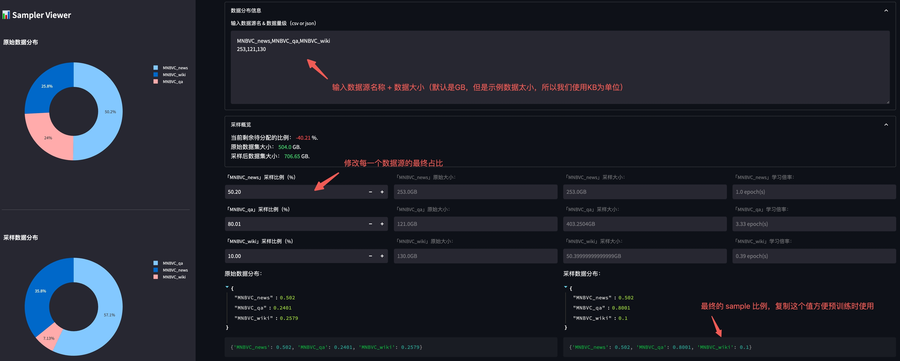

# 🦙 LLMs Trainer

LLMs Trainer 是一个旨在帮助人们从零开始训练大模型的仓库，该仓库最早参考自 [Open-Llama](https://github.com/beichao1314/Open-Llama)，并在其基础上进行扩充。

<br>

目前，该仓库将提供以下能力：

- [x] 继续预训练（Continue Pretraining）
- [x] 指令微调（Instruction Tuning）
- [x] 奖励模型训练（Reward Model）
- [ ] 强化学习（Reinforcement Learning）

<br>

有关 LLM 训练流程的更多细节可以参考 [这篇文章](https://zhuanlan.zhihu.com/p/636270877)。


使用仓库之前，请先安装所有需要的依赖：

```sh
pip install -r requirements.txt
```

---

## 1. 继续预训练（Continue Pretraining）

继续预训练是指，在一个已有的模型上继续进行预训练增强，通常用于 `英文模型的中文增强` 或是 `领域数据增强`。

我们这里以英文模型 [OpenLlama](https://huggingface.co/openlm-research/open_llama_7b_v2) 在中文数据集 [MNBVC](https://huggingface.co/datasets/liwu/MNBVC) 中的 **少量数据** 为例来演示整个流程。


### 1.1 数据压缩

由于预训练数据集通常比较庞大，因此先将训练数据进行压缩并流氏读取。

首先，进入到 `data` 目录:

```sh
cd data
```

找到目录下的 `compress_data.py`, 在该文件中修改需要压缩的数据路径：

```python
SHARD_SIZE = 10      # 单个文件存放样本的数量, 示例中使用很小，真实训练可以酌情增大
...

def batch_compress_preatrain_data():
    """
    批量压缩预训练数据。
    """
    source_path = 'shuffled_data/pretrain'                  # 源数据文件
    target_path = 'pretrain_data'                           # 压缩后存放地址

    files = [                                               # 这三个文件是示例数据
        'MNBVC_news',
        'MNBVC_qa',
        'MNBVC_wiki'
    ]
    ...

if __name__ == '__main__':
    batch_compress_preatrain_data()
    # batch_compress_sft_data()
```
> Notes: 上述的 files 可以在 shuffled_data/pretrain/ 中找到，是我们准备的少量示例数据，真实训练中请替换为完整数据。

在 `data` 路径中执行 `python compress_data.py`, 终端将显示：

```sh
processed shuffled_data/pretrain/MNBVC_news.jsonl...
total line: 100
total files: 10
processed shuffled_data/pretrain/MNBVC_qa.jsonl...
total line: 50
total files: 5
processed shuffled_data/pretrain/MNBVC_wiki.jsonl...
total line: 100
total files: 10
```

随后可在 `pretrain_data` 中找到对应的 `.jsonl.zst` 压缩文件（该路径将在之后的训练中使用）。


### 1.2 数据源采样比例（可选）

为了更好的进行不同数据源的采样，我们提供了按照预设比例进行数据采样的功能。

我们提供了一个可视化工具用于调整不同数据源之间的分布，在 `根目录` 下使用以下命令启动：

```sh
streamlit run utils/sampler_viewer/web.py --server.port 8001
```

随后在浏览器中访问 `机器IP:8001` 即可打开平台。

我们查看 `data/shuffled_data/pretrain` 下各数据的原始文件大小：

```sh
-rw-r--r--@ 1 xx  staff   253K Aug  2 16:38 MNBVC_news.jsonl
-rw-r--r--@ 1 xx  staff   121K Aug  2 16:38 MNBVC_qa.jsonl
-rw-r--r--@ 1 xx  staff   130K Aug  2 16:37 MNBVC_wiki.jsonl
```

并将文件大小按照格式贴到平台中：

<div align=center></div>

调整完毕后，复制上图右下角的最终比例，便于后续训练使用。


### 1.3 词表扩充（可选）

由于原始 Llama 的中文 token 很少，因此我们可以选择对原有的 tokenizer 进行词表扩充。

进入到 `utils` 目录：

```sh
cd utils
```

修改文件 `train_tokenizer.py` 中的训练数据（我们使用正式预训练训练数据集作为训练词表的数据集）：

```python
...
dataset = {
    "MNBVC_news": "../data/pretrain_data/MNBVC_news/*.jsonl.zst",
    "MNBVC_qa": "../data/pretrain_data/MNBVC_qa/*.jsonl.zst",
    "MNBVC_wiki": "../data/pretrain_data/MNBVC_wiki/*.jsonl.zst",
}
```

执行完 `train_tokenizer.py` 后，路径下会出现训练好的模型 `test_tokenizer.model`。

随后，我们将训练好的 model 和原本的 llama model 做融合：

```sh
python merge_tokenizer.py
```

你可以使用 [这个工具](https://github.com/HarderThenHarder/transformers_tasks/tree/main/tools/tokenizer_viewer) 很方便的对合并好后的 tokenizer 进行可视化。


### 1.4 平均初始化 extend token embedding（可选）

为了减小扩展的 token embedding 随机初始化带来模型性能的影响，我们提供使用将新 token 在原 tokenizer 中的 sub-token embedding 的平均值做为初始化 embedding 的方法。

具体使用方法在 `utils/extend_model_token_embeddings.py`。


### 1.5 正式训练

当完成上述步骤后就可以开始正式进行训练，使用以下命令启动训练：

```sh
sh train_llms.sh configs/accelerate_configs/ds_stage1.yaml \
    configs/pretrain_configs/llama.yaml \
    openlm-research/open_llama_7b_v2
```

多机多卡则启动：

```sh
sh train_multi_node_reward_model.sh configs/accelerate_configs/ds_stage1.yaml \
    configs/pretrain_configs/llama.yaml \
    openlm-research/open_llama_7b_v2
```

注意，所有的训练配置都放在了第 2 个参数 `configs/pretrain_configs/llama.yaml` 中，我们挑几个重要的参数介绍。

* `tokenizer_path (str)`：tokenizer 加载路径。

* `ckpt (str)`：初始 model 加载路径。

* `sample_policy_file (str)`：数据源采样配置文件，若不包含这一项则不进行数据源采样。

* `train_and_eval (bool)`：该参数决定了是否在训练中执行评估函数。

* `img_log_dir (str)`：训练过程中的 log 图存放目录。

* `eval_methods (list)`：使用哪些评估函数，包括：
    
    * single_choice_eval: 单选题正确率测试（如: [C-Eval](https://github.com/SJTU-LIT/ceval)），评估数据格式参考 `eval_data/knowledge/knowledge_and_reasoning.jsonl`。

    * generation_eval: 生成测试，给定 prompt，测试模型生成能力，评估数据格式参考 `eval_data/pretrain/generation_test.jsonl`。

* `work_dir (str)`：训练模型存放路径。

* `save_total_limit (int)`：最多保存的模型个数（超过数目则删除旧的模型）


## 2. 指令微调（Instruction Tuning）

我们准备了部分 `ShareGPT` 的数据作为示例数据，我们仍旧使用 [OpenLlama](https://huggingface.co/openlm-research/open_llama_7b_v2) 作为训练的基座模型。


### 2.1 数据压缩

同预训练一样，我们先进入到 `data` 目录:

```sh
cd data
```

找到目录下的 `compress_data.py`, 在该文件中修改需要压缩的数据路径：

```python
SHARD_SIZE = 10      # 单个文件存放样本的数量, 示例中使用很小，真实训练可以酌情增大
...

def batch_compress_sft_data():
    """
    批量压缩SFT数据。
    """
    source_path = 'shuffled_data/sft'
    target_path = 'sft_data'

    files = [
        'sharegpt'
    ]
    ...

if __name__ == '__main__':
    # batch_compress_preatrain_data()
    batch_compress_sft_data()
```
> Notes: 上述的 files 可以在 shuffled_data/sft/ 中找到，是我们准备的少量示例数据，真实训练中请替换为完整数据。

在 `data` 路径中执行 `python compress_data.py`, 终端将显示：

```sh
processed shuffled_data/sft/sharegpt.jsonl...
total line: 9637
total files: 964
```

随后可在 `sft_data` 中找到对应的 `.jsonl.zst` 压缩文件（该路径将在之后的训练中使用）。


### 2.2 特殊 token 扩充

受到 [ChatML](https://github.com/openai/openai-python/blob/main/chatml.md) 的启发，我们需要在原有的 tokenizer 中添加一些 special token 用于对话系统。

一种最简单的方式是在 tokenizer 路径中找到 `special_tokens_map.json` 文件，并添加以下内容：

```python
{
    ...                                         # 需要添加的特殊 token
    "system_token": "<|system|>",               # system prompt
    "user_token": "<|user|>",                   # user token
    "assistant_token": "<|assistant|>",         # chat-bot token
    "chat_end_token": "<|endofchat|>"           # chat end token
}
```


### 2.3 微调训练

当完成上述步骤后就可以开始正式进行训练，使用以下命令启动训练：

```sh
sh train_llms.sh configs/accelerate_configs/ds_stage1.yaml \
    configs/sft_configs/llama.yaml \
    openlm-research/open_llama_7b_v2
```

多机多卡则启动：

```sh
sh train_multi_node_reward_model.sh configs/accelerate_configs/ds_stage1.yaml \
    configs/sft_configs/llama.yaml \
    openlm-research/open_llama_7b_v2
```

注意，所有的训练配置都放在了第 2 个参数 `configs/sft_configs/llama.yaml` 中，我们挑几个重要的参数介绍。

* `tokenizer_path (str)`：tokenizer 加载路径。

* `ckpt (str)`：初始 model 加载路径。

* `train_and_eval (bool)`：该参数决定了是否在训练中执行评估函数。

* `img_log_dir (str)`：训练过程中的 log 图存放目录。

* `eval_methods (list)`：使用哪些评估函数，包括：

    * generation_eval: 生成测试，给定 prompt，测试模型生成能力，评估数据格式参考 `eval_data/sft/share_gpt_test.jsonl`。

    * 暂无。

* `work_dir (str)`：训练模型存放路径。

* `save_total_limit (int)`：最多保存的模型个数（超过数目则删除旧的模型）


## 3. 奖励模型（Reward Model）


### 3.1 数据集准备

我们准备 1000 条偏序对作为示例训练数据，其中 `selected` 为优势样本，`rejected` 为劣势样本：

```python
{
    "prompt": "下面是一条正面的评论：",
    "selected": "很好用，一瓶都用完了才来评价。",
    "rejected": "找了很久大小包装都没找到生产日期。上当了。"
}
```

这个步骤不再需要数据压缩，因此准备好上述结构的 `.jsonl` 文件即可。


### 3.2 RM 训练

当完成上述步骤后就可以开始正式进行训练，使用以下命令启动训练：

```sh
sh train_multi_node_reward_model.sh \
    configs/accelerate_configs/ds_stage1.yaml \
    configs/reward_model_configs/llama7b.yaml
```

注意，所有的训练配置都放在了第 2 个参数 `configs/reward_model_configs/llama.yaml` 中，我们挑几个重要的参数介绍。

* `tokenizer_path (str)`：tokenizer 加载路径。

* `ckpt (str)`：初始 model 加载路径。

* `train_and_eval (bool)`：该参数决定了是否在训练中执行评估函数。

* `img_log_dir (str)`：训练过程中的 log 图存放目录。

* `test_reward_model_acc_files (list)`：acc 测试文件列表。

* `work_dir (str)`：训练模型存放路径。

* `save_total_limit (int)`：最多保存的模型个数（超过数目则删除旧的模型）