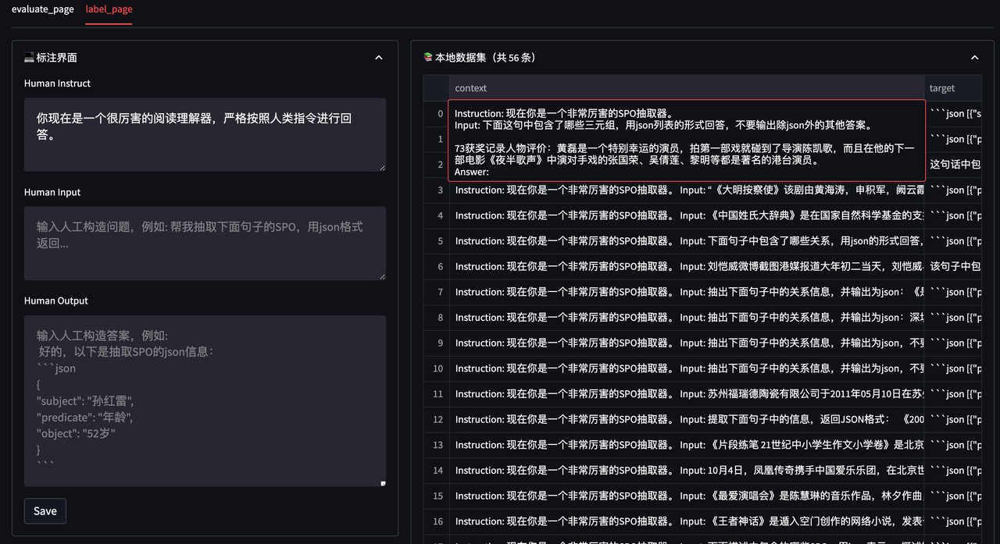
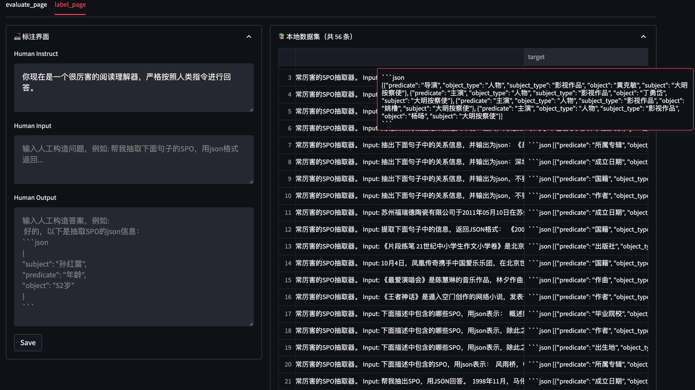

# Finetune ChatGLM-6B

LLM（Large Language Model）通常拥有大量的先验知识，使得其在许多自然语言处理任务上都有着不错的性能。

但，想要直接利用 LLM 完成一些任务会存在一些答案解析上的困难，如规范化输出格式，严格服从输入信息等。

> Zero-Shot 实验代码在 [这里](../zero-shot/readme.md)。

因此，在这个项目下我们参考 [这里](https://github.com/mymusise/ChatGLM-Tuning/tree/master) 的代码，尝试对大模型 [ChatGLM-6B](https://github.com/THUDM/ChatGLM-6B) 进行 Finetune，使其能够更好的对齐我们所需要的输出格式。

<br>

## 1. 环境安装

由于 ChatGLM 需要的环境和该项目中其他实验中的环境有所不同，因此我们强烈建议您创建一个新的虚拟环境来执行该目录下的全部代码。

下面，我们将以 `Anaconda` 为例，展示如何快速搭建一个环境：

1. 创建一个虚拟环境，您可以把 `llm_env` 修改为任意你想要新建的环境名称：

```sh
conda create -n llm_env python=3.8
```

2. 激活新建虚拟环境并安装响应的依赖包：

```sh
conda activate llm_env
pip install -r requirements.txt
```

3. 安装对应版本的 `peft`：

```sh
cd peft-chatglm
python setup.py install
```

<br>

## 2. 数据集准备

在该实验中，我们将尝试使用 `信息抽取` + `文本分类` 任务的混合数据集喂给模型做 finetune，数据集在 `data/mixed_train_dataset.jsonl`。

每一条数据都分为 `context` 和 `target` 两部分：

1.  `context` 部分是接受用户的输入。

2. `target` 部分用于指定模型的输出。

在 `context` 中又包括 2 个部分：

1. Instruction：用于告知模型的具体指令，当需要一个模型同时解决多个任务时可以设定不同的 Instruction 来帮助模型判别当前应当做什么任务。

2. Input：当前用户的输入。

*  信息抽取数据示例

Instruction 部分告诉模型现在需要做「阅读理解」任务，Input 部分告知模型要抽取的句子以及输出的格式。

```json
{
    "context": "Instruction: 你现在是一个很厉害的阅读理解器，严格按照人类指令进行回答。\nInput: 找到句子中的三元组信息并输出成json给我:\n\n九玄珠是在纵横中文网连载的一部小说，作者是龙马。\nAnswer: ", 
    "target": "```json\n[{\"predicate\": \"连载网站\", \"object_type\": \"网站\", \"subject_type\": \"网络小说\", \"object\": \"纵横中文网\", \"subject\": \"九玄珠\"}, {\"predicate\": \"作者\", \"object_type\": \"人物\", \"subject_type\": \"图书作品\", \"object\": \"龙马\", \"subject\": \"九玄珠\"}]\n```"
}
```

*  文本分类数据示例

Instruction 部分告诉模型现在需要做「阅读理解」任务，Input 部分告知模型要抽取的句子以及输出的格式。

```json
{
    "context": "Instruction: 你现在是一个很厉害的阅读理解器，严格按照人类指令进行回答。\nInput: 下面句子可能是一条关于什么的评论，用列表形式回答：\n\n很不错，很新鲜，快递小哥服务很好，水果也挺甜挺脆的\nAnswer: ", 
    "target": "[\"水果\"]"
}
```

<br>

## 3. 模型训练

### 3.1 单卡训练

实验中支持使用 [LoRA Finetune](https://arxiv.org/abs/2106.09685) 和 [P-Tuning](https://github.com/THUDM/P-tuning-v2) 两种微调方式。

运行 `train.sh` 文件，根据自己 GPU 的显存调节 `batch_size`, `max_source_seq_len`, `max_target_seq_len` 参数：

```sh
# LoRA Finetune
python train.py \
    --train_path data/mixed_train_dataset.jsonl \
    --dev_path data/mixed_dev_dataset.jsonl \
    --use_lora True \
    --lora_rank 8 \
    --batch_size 1 \
    --num_train_epochs 2 \
    --save_freq 1000 \
    --learning_rate 3e-5 \
    --logging_steps 100 \
    --max_source_seq_len 400 \
    --max_target_seq_len 300 \
    --save_dir checkpoints/finetune \
    --img_log_dir "log/fintune_log" \
    --img_log_name "ChatGLM Fine-Tune" \
    --device cuda:0


# P-Tuning
python train.py \
    --train_path data/mixed_train_dataset.jsonl \
    --dev_path data/mixed_dev_dataset.jsonl \
    --use_ptuning True \
    --pre_seq_len 128 \
    --batch_size 1 \
    --num_train_epochs 2 \
    --save_freq 200 \
    --learning_rate 2e-4 \
    --logging_steps 100 \
    --max_source_seq_len 400 \
    --max_target_seq_len 300 \
    --save_dir checkpoints/ptuning \
    --img_log_dir "log/fintune_log" \
    --img_log_name "ChatGLM P-Tuning" \
    --device cuda:0
```

成功运行程序后，会看到如下界面：

```python
...
global step 900 ( 49.89% ) , epoch: 1, loss: 0.78065, speed: 1.25 step/s, ETA: 00:12:05
global step 1000 ( 55.43% ) , epoch: 2, loss: 0.71768, speed: 1.25 step/s, ETA: 00:10:44
Model has saved at checkpoints/model_1000.
Evaluation Loss: 0.17297
Min eval loss has been updated: 0.26805 --> 0.17297
Best model has saved at checkpoints/model_best.
global step 1100 ( 60.98% ) , epoch: 2, loss: 0.66633, speed: 1.24 step/s, ETA: 00:09:26
global step 1200 ( 66.52% ) , epoch: 2, loss: 0.62207, speed: 1.24 step/s, ETA: 00:08:06
...
```

在 `log/finetune_log` 下会看到训练 loss 的曲线图：

<div align='center'></div>

<br>

### 3.2 多卡训练

运行 `train_multi_gpu.sh` 文件，通过 `CUDA_VISIBLE_DEVICES` 指定可用显卡，`num_processes` 指定使用显卡数：

```sh
# LoRA Finetune
CUDA_VISIBLE_DEVICES=0,1 accelerate launch --multi_gpu --mixed_precision=fp16 --num_processes=2 train_multi_gpu.py \
    --train_path data/mixed_train_dataset.jsonl \
    --dev_path data/mixed_dev_dataset.jsonl \
    --use_lora True \
    --lora_rank 8 \
    --batch_size 1 \
    --num_train_epochs 2 \
    --save_freq 500 \
    --learning_rate 3e-5 \
    --logging_steps 100 \
    --max_source_seq_len 400 \
    --max_target_seq_len 300 \
    --save_dir checkpoints_parrallel/finetune \
    --img_log_dir "log/fintune_log" \
    --img_log_name "ChatGLM Fine-Tune(parallel)"


# P-Tuning
CUDA_VISIBLE_DEVICES=0,1 accelerate launch --multi_gpu --mixed_precision=fp16 --num_processes=2 train_multi_gpu.py \
    --train_path data/mixed_train_dataset.jsonl \
    --dev_path data/mixed_dev_dataset.jsonl \
    --use_ptuning True \
    --pre_seq_len 128 \
    --batch_size 1 \
    --num_train_epochs 2 \
    --save_freq 500 \
    --learning_rate 2e-4 \
    --logging_steps 100 \
    --max_source_seq_len 400 \
    --max_target_seq_len 300 \
    --save_dir checkpoints_parrallel/ptuning \
    --img_log_dir "log/fintune_log" \
    --img_log_name "ChatGLM P-Tuning(parallel)"
```

相同数据集下，单卡使用时间：

```python
Used 00:27:18.
```

多卡（2并行）使用时间：

```python
Used 00:13:05.
```

<br>

## 4. 模型预测

修改训练模型的存放路径，运行 `python inference.py` 以测试训练好模型的效果：

```python
device = 'cuda:0'
max_new_tokens = 300
model_path = "checkpoints/model_1000"           # 模型存放路径

tokenizer = AutoTokenizer.from_pretrained(
    model_path, 
    trust_remote_code=True
)

model = AutoModel.from_pretrained(
    model_path,
    trust_remote_code=True
).half().to(device)
...
```

您也可以使用我们提供的 Playground 来进行模型效果测试：

```sh
streamlit run playground_local.py --server.port 8001
```

在浏览器中打开对应的 `机器ip:8001` 即可访问。

<div align='center'></div>


<br>

## 5. 标注平台

如果您需要标注自己的数据，也可以在 Playground 中完成。

```sh
streamlit run playground_local.py --server.port 8001
```

在浏览器中打开对应的 `机器ip:8001` 即可访问。

<table>
<tr>
<td></td>
<td></td>
</tr>
</table>