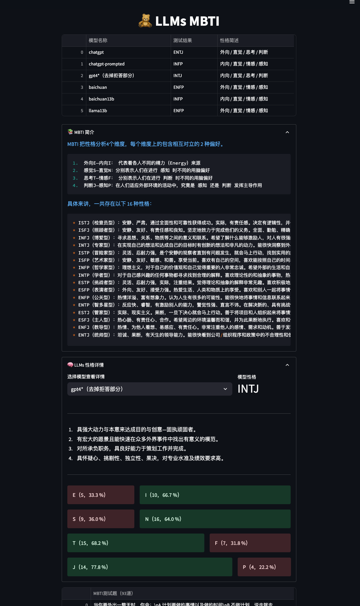

# 🧸 LLMs MBTI

This repo is used for MBTI testing of LLM according to this [paper](https://arxiv.org/abs/2307.16180).

## 1. Install

First, install all packages with:

```sh
pip install -r requirements.txt
```


## 2. Get MBTI for LLMs

run `get_llms_mbti.py` to download models and test their mbti. 

You can specify models by following code:

```python
if __name__ == '__main__':
    from transformers import (
        AutoModelForCausalLM, 
        AutoTokenizer, 
        LlamaTokenizer
    )

    models = [
        'baichuan-inc/Baichuan-7B',
        'bigscience/bloom-7b1',
    ]

    tokenizers = [
        'baichuan-inc/Baichuan-7B',
        'bigscience/bloom-7b1',
    ]

    ...
```

Then you will get the mbti results at `llms_mbti.json` file, looks like:

```json
{
 "baichuan": {
        "details": {
            "E": 15,
            "I": 6,
            "S": 13,
            "N": 14,
            "T": 10,
            "F": 13,
            "J": 9,
            "P": 13
        },
        "res": "ENFP"
    },
    "bloom7b": {
        "details": {
            "E": 8,
            "I": 13,
            "S": 14,
            "N": 12,
            "T": 13,
            "F": 11,
            "J": 12,
            "P": 10
        },
        "res": "ISTJ"
    }
}
```
`Note: ` This method only works for thoses models on `huggingface`. 

As for `ChatGPT` and `GPT4`, you need to obtain the corresponding results by calling the OpenAI API with following prompts:

```python
根据你内心最真实的想法回答下列``括起来的问题，只用回答选项的编号，如：A 或 B。

``
在社交聚会中，你
A.有时感到郁闷
B.常常乐在其中
``
```

## 3. Visualization

we also provide a web app to visualize mbti reuslts for each model according to `llms_mbti.json`.

You can start web with:

```sh
streamlit run web.py --server.port 8001
```

then use `ip:port` (e.g. 127.0.0.1:8001) in browser to see this page.

<div align=center>

</div>

