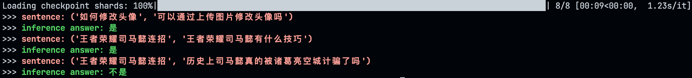
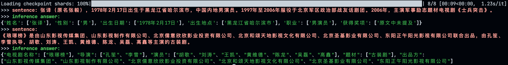
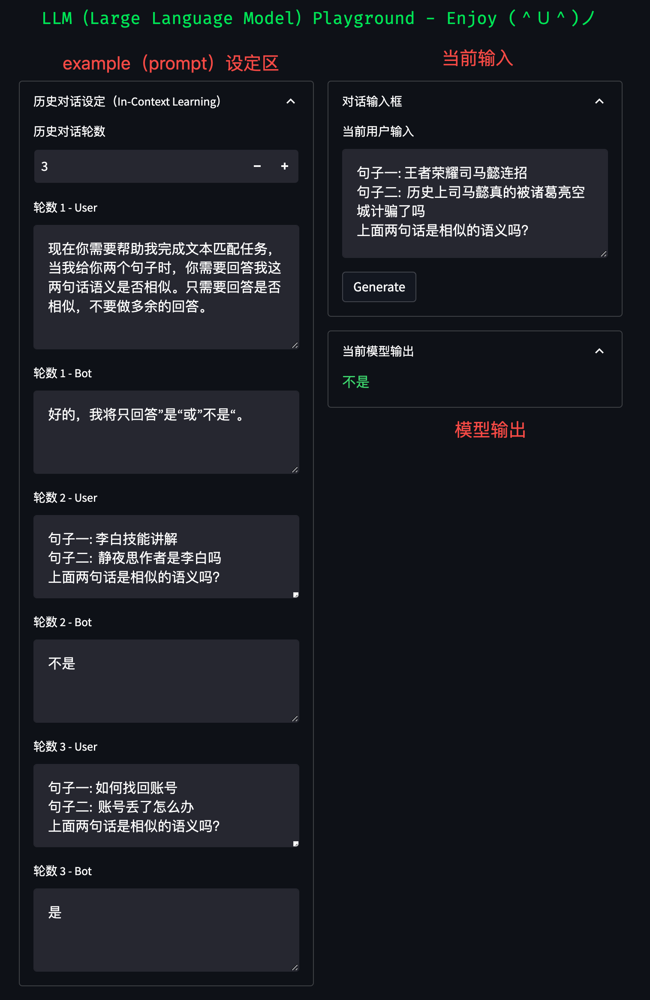

# LLM（Large Language Model）下的自然语言处理任务

随着 ChatGPT 和 GPT-4 等强大生成模型出现，自然语言处理任务方式正在逐步发生改变。

鉴于大模型强大的任务处理能力，未来我们或将不再为每一个具体任务去 finetune 一个模型，

而是使用同一个大模型，对不同任务设计其独有的 prompt，以解决不同的任务问题。

在该实验中，我们将基于清华开源大模型 [ChatGLM-6B](https://github.com/THUDM/ChatGLM-6B)， 提供多个自然语言处理任务如何通过 prompt 来实现 zero-shot 的案例，

希望能够对你有所启发。

## 1. 环境安装

由于 ChatGLM 需要的环境和该项目中其他实验中的环境有所不同，因此我们强烈建议您创建一个新的虚拟环境来执行该目录下的全部代码。

下面，我们将以 `Anaconda` 为例，展示如何快速搭建一个环境：

1. 创建一个虚拟环境，您可以把 `llm_env` 修改为任意你想要新建的环境名称：

```sh
conda create -n llm_env python=3.8
```

2. 激活新建虚拟环境并安装响应的依赖包：

```sh
conda activate llm_env
pip install -r requirements.txt
```

## 2. 文本分类任务（Text Classification）

在 `llm_classification.py` 文件中，我们展示了一个根据描述内容，对描述物体进行类型识别的例子。

### 2.1 任务描述

如下所示，我们从 `百度百科` 中选择了几段描述文本：

```python
1. 加拿大（英语/法语：Canada），首都渥太华，位于北美洲北部。东临大西洋，西濒太平洋，西北部邻美国阿拉斯加州，南接美国本土，北靠北冰洋。气候大部分为亚寒带针叶林气候和湿润大陆性气候，北部极地区域为极地长寒气候。
2. 《琅琊榜》是由山东影视传媒集团、山东影视制作有限公司、北京儒意欣欣影业投资有限公司、北京和颂天地影视文化有限公司、北京圣基影业有限公司、东阳正午阳光影视有限公司联合出品，由孔笙、李雪执导，胡歌、刘涛、王凯、黄维德、陈龙、吴磊、高鑫等主演的古装剧。
3. 《满江红》是由张艺谋执导，沈腾、易烊千玺、张译、雷佳音、岳云鹏、王佳怡领衔主演，潘斌龙、余皑磊主演，郭京飞、欧豪友情出演，魏翔、张弛、黄炎特别出演，许静雅、蒋鹏宇、林博洋、飞凡、任思诺、陈永胜出演的悬疑喜剧电影。
4. 布宜诺斯艾利斯（Buenos Aires，华人常简称为布宜诺斯）是阿根廷共和国（the Republic of Argentina，República Argentina）的首都和最大城市，位于拉普拉塔河南岸、南美洲东南部、河对岸为乌拉圭东岸共和国。
5. 张译（原名张毅），1978年2月17日出生于黑龙江省哈尔滨市，中国内地男演员。1997年至2006年服役于北京军区政治部战友话剧团。2006年，主演军事励志题材电视剧《士兵突击》。
```

我们期望模型能够帮我们识别出这 5 句话中，每一句话描述的是一个什么 `类型` 的物体。

这 5 段描述分别节选自：

```python
['加拿大', '《琅琊榜》', '《满江红》', '布宜诺斯艾利斯', '张译']
```

因此，我们期望模型输出的结果为：

```python
['国家', '电视剧', '电影', '城市', '人物']
```

### 2.2 prompt 设计

对于大模型来讲，prompt 的设计非常重要，一个 `明确` 的 prompt 能够帮助我们更好从大模型中获得我们想要的结果。

在该任务的 prompt 设计中，我们主要考虑 2 点：

* 需要向模型解释什么叫作「文本分类任务」

* 需要让模型按照我们指定的格式输出

为了让模型知道什么叫做「文本分类」，我们借用 Incontext Learning 的方式，先给模型展示几个正确的例子：

```python
>>> User: "岳云鹏，本名岳龙刚，1985年4月15日出生于河南省濮阳市南乐县，中国内地相声、影视男演员。" 是 ['人物', '书籍', '电视剧', '电影', '城市', '国家'] 里的什么类别？
>>> Bot: 人物
>>> User: "《三体》是刘慈欣创作的长篇科幻小说系列，由《三体》《三体2：黑暗森林》《三体3：死神永生》组成，第一部于2006年5月起在《科幻世界》杂志上连载，第二部于2008年5月首次出版，第三部则于2010年11月出版。" 是 ['人物', '书籍', '电视剧', '电影', '城市', '国家'] 里的什么类别？
>>> Bot: 书籍
...
```

其中，`User` 代表我们输入给模型的句子，`Bot` 代表模型的回复内容。

注意：上述例子中 `Bot` 的部分也是由人工输入的，其目的是希望看到在看到类似 `User` 中的句子时，模型应当做出类似 `Bot` 的回答。

这部分提供给模型看的 `例子`，在代码开头中的 `class_example` 变量里：

```python
# 提供所有类别以及每个类别下的样例
class_examples = {
        '人物': '岳云鹏，本名岳龙刚，1985年4月15日出生于河南省濮阳市南乐县，中国内地相声、影视男演员 [1]  。2005年，首次登台演出。2012年，主演卢卫国执导的喜剧电影《就是闹着玩的》。2013年在北京举办相声专场。',
        '书籍': '《三体》是刘慈欣创作的长篇科幻小说系列，由《三体》《三体2：黑暗森林》《三体3：死神永生》组成，第一部于2006年5月起在《科幻世界》杂志上连载，第二部于2008年5月首次出版，第三部则于2010年11月出版。',
        '电视剧': '《狂飙》是由中央电视台、爱奇艺出品，留白影视、中国长安出版传媒联合出品，中央政法委宣传教育局、中央政法委政法综治信息中心指导拍摄，徐纪周执导，张译、张颂文、李一桐、张志坚、吴刚领衔主演，倪大红、韩童生、李建义、石兆琪特邀主演，李健、高叶、王骁等主演的反黑刑侦剧。',
        '电影': '《流浪地球》是由郭帆执导，吴京特别出演、屈楚萧、赵今麦、李光洁、吴孟达等领衔主演的科幻冒险电影。影片根据刘慈欣的同名小说改编，故事背景设定在2075年，讲述了太阳即将毁灭，毁灭之后的太阳系已经不适合人类生存，而面对绝境，人类将开启“流浪地球”计划，试图带着地球一起逃离太阳系，寻找人类新家园的故事。',
        '城市': '乐山，古称嘉州，四川省辖地级市，位于四川中部，四川盆地西南部，地势西南高，东北低，属中亚热带气候带；辖4区、6县，代管1个县级市，全市总面积12720.03平方公里；截至2021年底，全市常住人口315.1万人。',
        '国家': '瑞士联邦（Swiss Confederation），简称“瑞士”，首都伯尔尼，位于欧洲中部，北与德国接壤，东临奥地利和列支敦士登，南临意大利，西临法国。地处北温带，四季分明，全国地势高峻，矿产资源匮乏，森林及水力资源丰富，总面积41284平方千米，全国由26个州组成（其中6个州为半州）。'
    }
...
```

您可以在该变量中 修改 / 添加 自定义的例子。

### 2.3 运行结果

运行程序：

```python
python llm_classification.py 
```

运行程序后，程序将自动下载模型，由于模型参数较大（6B），下载到本地大概需要 12G+ 的磁盘空间，请确保磁盘有充足的空间。

此外，加载模型大概需要 13G 左右的显存，如果您显存不够，可以参考 [这里](https://github.com/THUDM/ChatGLM-6B/tree/main#%E6%A8%A1%E5%9E%8B%E9%87%8F%E5%8C%96) 进行模型量化加载以缩小模型成本。

模型推理结果如下：

<div center='align'></div>


## 3. 文本匹配任务（Text Matching）

在 `llm_text_matching.py` 文件中，我们展示了一个根据句子对进行语义匹配的例子。

### 3.1 任务描述

如下所示，我们构造了几个短文本对：

```python
1. ('如何修改头像', '可以通过上传图片修改头像吗')
2. ('王者荣耀司马懿连招', '王者荣耀司马懿有什么技巧')
3. ('王者荣耀司马懿连招', '历史上司马懿真的被诸葛亮空城计骗了吗')
```

我们期望模型能够帮我们识别出这 3 对句子中，哪几对描述的是相似的语言。

我们期望模型输出的结果为：

```python
['相似', '相似', '不相似']
```

### 3.2 prompt 设计

同样，在该任务的 prompt 设计中，我们主要考虑 2 点：

* 需要向模型解释什么叫作「文本匹配任务」

* 需要让模型按照我们指定的格式输出

为了让模型知道什么叫做「相似语言判断任务」，我们借用 Incontext Learning 的方式，先给模型展示几个正确的例子：

```python
>>> User: 句子一: 如何找回账号\n句子二: 账号丢了怎么办\n上面两句话是相似的语义吗？
>>> Bot: 是
>>> User: 如何找回账号\n句子二: 附近最近的饭店\n上面两句话是相似的语义吗？
>>> Bot: 不是
...
```

其中，`User` 代表我们输入给模型的句子，`Bot` 代表模型的回复内容。

注意：上述例子中 `Bot` 的部分也是由人工输入的，其目的是希望看到在看到类似 `User` 中的句子时，模型应当做出类似 `Bot` 的回答。

这部分提供给模型看的 `例子`，在代码开头中的 `examples` 变量里：

```python
# 提供相似，不相似的语义匹配例子
examples = {
    '是': [
        ('如何找回账号', '账号丢了怎么办'),
    ],
    '不是': [
        ('如何找回账号', '附近最近的饭店'),
        ('李白技能讲解', '静夜思作者是李白吗')
    ]
}
...
```

您可以在该变量中 修改 / 添加 自定义的例子。

### 3.3 运行结果

运行程序：

```python
python llm_text_matching.py 
```

运行程序后，程序将自动下载模型，由于模型参数较大（6B），下载到本地大概需要 12G+ 的磁盘空间，请确保磁盘有充足的空间。

此外，加载模型大概需要 13G 左右的显存，如果您显存不够，可以参考 [这里](https://github.com/THUDM/ChatGLM-6B/tree/main#%E6%A8%A1%E5%9E%8B%E9%87%8F%E5%8C%96) 进行模型量化加载以缩小模型成本。

模型推理结果如下：

<div center='align'></div>


## 4. 信息抽取（Information Extraction）

在 `llm_information_extraction.py` 文件中，我们展示了一个信息抽取例子。

### 4.1 任务描述

首先，我们定义信息抽取的 schema：

```python
# 定义不同实体下的具备属性
schema = {
    '人物': ['姓名', '性别', '出生日期', '出生地点', '职业', '获得奖项', '实体类型'],
    '书籍': ['作者', '类型', '发行时间', '定价', '实体类型'],
    '电视剧': ['导演', '演员', '题材', '出品方', '实体类型']
}
```

随后，我们从百度百科中找到一些句子，并利用模型进行信息抽取：

```python
1. 张译（原名张毅），1978年2月17日出生于黑龙江省哈尔滨市，中国内地男演员。1997年至2006年服役于北京军区政治部战友话剧团。2006年，主演军事励志题材电视剧《士兵突击》。
2. 《琅琊榜》是由山东影视传媒集团、山东影视制作有限公司、北京儒意欣欣影业投资有限公司、北京和颂天地影视文化有限公司、北京圣基影业有限公司、东阳正午阳光影视有限公司联合出品，由孔笙、李雪执导，胡歌、刘涛、王凯、黄维德、陈龙、吴磊、高鑫等主演的古装剧。
```

### 4.2 prompt 设计

同样，在该任务的 prompt 设计中，我们主要考虑 2 点：

* 需要向模型解释什么叫作「信息抽取任务」

* 需要让模型按照我们指定的格式（json）输出

为了让模型知道什么叫做「信息抽取」，我们借用 Incontext Learning 的方式，先给模型展示几个正确的例子：

```python
>>> User: 岳云鹏，本名岳龙刚，1985年4月15日出生于河南省濮阳市南乐县，中国内地相声、影视男演员。2005年，首次登台演出。2012年，主演卢卫国执导的喜剧电影《就是闹着玩的》。2013年在北京举办相声专场。提取上述句子中“人物”(姓名, 性别, 出生日期, 出生地点, 职业, 获得奖项)类型的实体，并按照JSON格式输出，上述句子中没有的信息用['原文中未提及']来表示，多个值之间用','分隔。
>>> Bot: {"姓名": ["岳云鹏"], "性别": ["男"], "出生日期": ["1985年4月15日"], "出生地点": ["河南省濮阳市南乐县"], "职业": ["相声演员", "影视演员"], "获得奖项": ["原文中未提及"]}
...
```

其中，`User` 代表我们输入给模型的句子，`Bot` 代表模型的回复内容。

注意：上述例子中 `Bot` 的部分也是由人工输入的，其目的是希望看到在看到类似 `User` 中的句子时，模型应当做出类似 `Bot` 的回答。

这部分提供给模型看的 `例子`，在代码开头中的 `ie_examples` 变量里：

```python
# 提供一些例子供模型参考
ie_examples = {
        '人物': [
                    {
                        'content': '岳云鹏，本名岳龙刚，1985年4月15日出生于河南省濮阳市南乐县，中国内地相声、影视男演员。',
                        'answers': {
                                        '姓名': ['岳云鹏'],
                                        '性别': ['男'],
                                        '出生日期': ['1985年4月15日'],
                                        '出生地点': ['河南省濮阳市南乐县'],
                                        '职业': ['相声演员'],
                                        '获得奖项': ['原文中未提及']
                            }
                    }
        ],
        '书籍': [
                    {
                        'content': '《三体》是刘慈欣创作的长篇科幻小说系列，由《三体》《三体2：黑暗森林》《三体3：死神永生》组成，第一部于2006年5月起在《科幻世界》杂志上连载，第二部于2008年5月首次出版，第三部则于2010年11月出版。',
                        'answers': {
                                        '书名': ['《三体》'],
                                        '作者': ['刘慈欣'],
                                        '类型': ['长篇科幻小说'],
                                        '发行时间': ['2006年5月', '2008年5月', '2010年11月'],
                                        '定价': ['原文中未提及']
                            }
                    }
        ]
}
...
```

您可以在该变量中 修改 / 添加 自定义的例子。

### 4.3 运行结果

运行程序：

```python
python llm_information_extraction.py 
```

运行程序后，程序将自动下载模型，由于模型参数较大（6B），下载到本地大概需要 12G+ 的磁盘空间，请确保磁盘有充足的空间。

此外，加载模型大概需要 13G 左右的显存，如果您显存不够，可以参考 [这里](https://github.com/THUDM/ChatGLM-6B/tree/main#%E6%A8%A1%E5%9E%8B%E9%87%8F%E5%8C%96) 进行模型量化加载以缩小模型成本。

模型推理结果如下：

<div center='align'></div>


## 5. 实体链指（Entity Linking）

测试中...

## 6. 调试平台（Playground）

为了更方便的调试 prompt，您可以使用代码中包含的 Playground 进行 prompt 设计：

```sh
streamlit run playground.py --server.port 8001
```

随即，您可以在浏览器中输入 `机器ip:8001` 打开 Playground：

<div align=center></div>