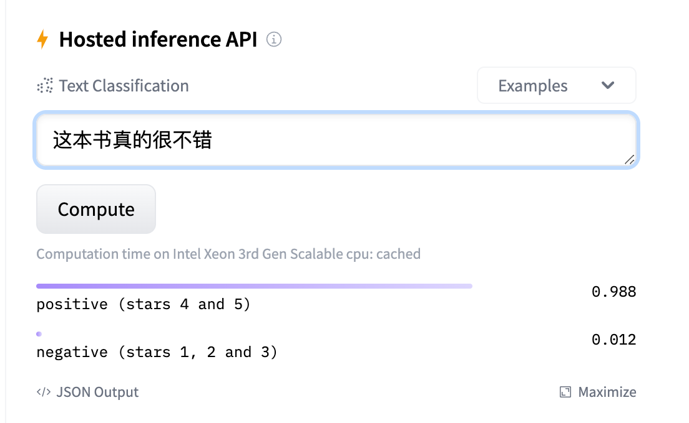
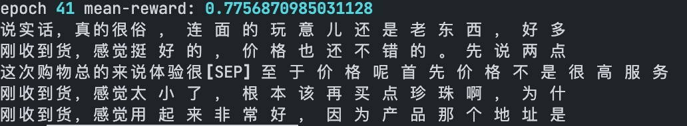
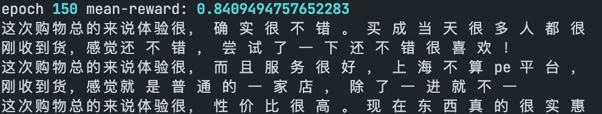
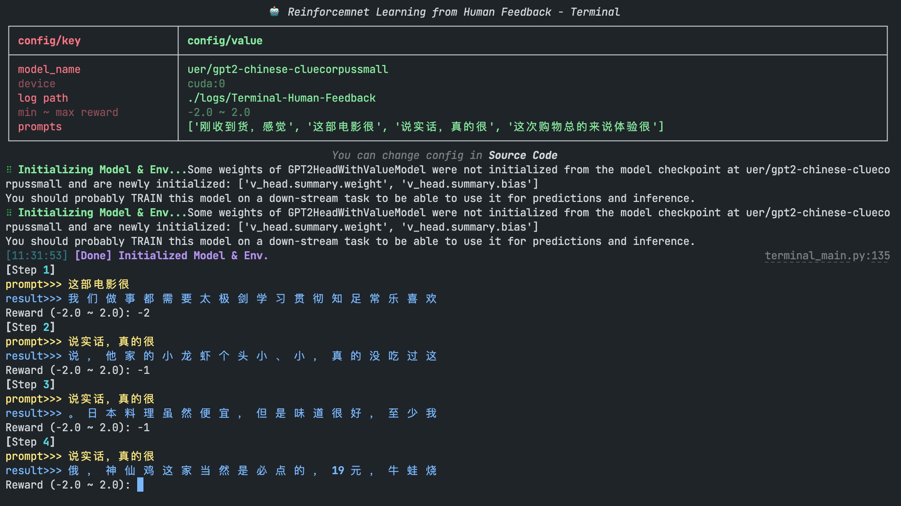
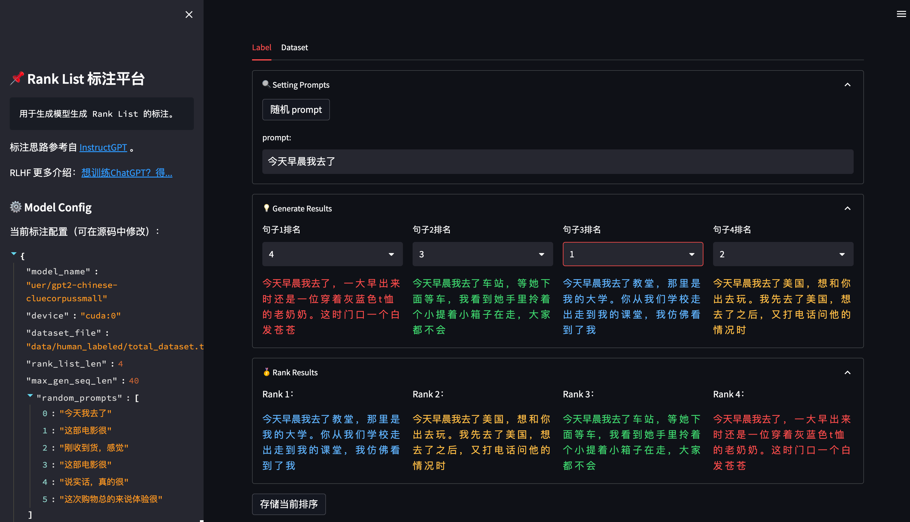
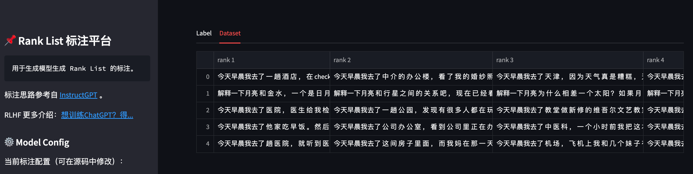

# Reinforcement Learning with Language Model

随着 ChatGPT 的爆火，强化学习（Reinforcement Learning）和语言生成模型（Language Model）的结合开始变得越来越受人关注。

有关 ChatGPT 的视频讲解可以参考[这里](https://www.bilibili.com/video/BV1BG4y137SH/?vd_source=0df98e40ba56afac31703b0d5dba509f#reply143954452208)。

该项目的详细介绍可以参考[这里](https://mp.weixin.qq.com/s/1v4Uuc1YAZ9MRr1UWMH9xw)。

在这个项目中，我们将通过开源项目 [trl](https://github.com/lvwerra/trl) 搭建一个通过强化学习算法（PPO）来更新语言模型（GPT-2）的几个示例，包括：

* 基于中文情感识别模型的正向评论生成机器人（No Human Reward）

* 基于人工打分的正向评论生成机器人（With Human Reward）

* 基于排序序列（Rank List）训练一个奖励模型（Reward Model）

* 排序序列（Rank List）标注平台

<br>

### 1. 基于中文情感识别模型的正向评论生成机器人（No Human Reward）

考虑现在我们有一个现成的语言模型（示例中选用中文的GPT2），通过一小段 `prompt`，模型能够继续生成一段文字，例如：

```python
prompt: 刚收到货，感觉有

output 1: 刚收到货，感觉有 点 不 符 合 预 期 ，不 好
output 2: 刚收到货，感觉有 挺 无 奈 的 送 货 速 度 不 太 行
...
```

我们现在希望语言模型能够学会生成「正向情感」的好评，而当前的 GPT 模型是不具备「情绪识别」能力的，如上面两个生成结果都不符合正面情绪。

为此，我们期望通过「强化学习」的方法来进化现有 GPT 模型，使其能够学会尽可能的生成「正面情感」的评论。

在强化学习中，当模型生成一个结果时，我们需要告知模型这个结果的得分（reward）是多少，即我们为模型的每一个生成结果打分，例如：


```python
output 1: 刚收到货，感觉有 点 不 符 合 预 期 ，不 好                -> 0.2 分
output 2: 刚收到货，感觉有 挺 无 奈 的 送 货 速 度 不 太 行          -> 0.1 分
output 3: 刚收到货，感觉有 些 惊 喜 于 货 物 质 量                  -> 0.9 分
...
```

如果依靠人工为每一个输出打分，这将是一个非常漫长的过程（在另一个示例中我们将实现该功能）。

因此，我们引入另一个「情绪识别模型」来模拟人工给出的分数。

「情绪识别模型」我们选用 transformers 中内置的 sentiment-analysis pipeline 来实现。

[该模型](https://huggingface.co/uer/roberta-base-finetuned-jd-binary-chinese)基于网络评论数据集训练，能够对句子进行「正向、负向」的情绪判别，如下所示：



我们利用该「情感识别模型」的判别结果（0.0~1.0）作为 GPT 生成模型的 reward，以指导 GPT 模型通过强化学习（PPO）算法进行迭代更新。

#### 1.1 训练流程

整个 PPO + GPT2 的训练流程如下所示：

  1. 随机选择一个 `prompt`，如："这部电影很"

  2. GPT 模型根据 `prompt` 生成答案，如："这部电影很 好 看 哦 ~ "

  3. 将 GPT 的生成答案喂给「情绪识别」模型，并得到评分（reward），如：0.9

  4. 利用评分（reward）对 GPT 模型进行优化。

重复该循环，直到训练结束为止。

#### 1.2 开始训练

本项目基于 `pytorch` + `transformers` 实现，运行前请安装相关依赖包：

```sh
pip install -r ../requirements.txt
```

运行训练脚本：

```sh
python ppo_sentiment_example.py
```

正常启动训练后，终端会打印如下数据：

```sh
...
epoch 0 mean-reward: 0.7271811366081238
Random Sample 5 text(s) of model output:
1. 刚收到货，感觉不 错 ， 会 冒 充 收 银 员 在 果 盘 盘 底 ， 就
2. 说实话，真的很般 般 ， 一 般 都 是 饭 点 去 ， 没 办 法 我 现
3. 说实话，真的很怪 不 得 刚 开 的 没 多 久 ， 现 在 上 海 这 个
4. 这部电影很啊 ， 所 以 ， 也 算 一 个 抛 砖 引 玉 。 昨 天
5. 这次购物总的来说体验很[SEP] ~ 满 意 谢 谢 送 货 很 快 [SEP] 为 什 么 输 出
  1%|▋                                                                                                     | 1/157 [00:55<2:23:53, 55.34s/it]
epoch 1 mean-reward: 0.7439988851547241
Random Sample 5 text(s) of model output:
1. 这次购物总的来说体验很我 不 知 道 表 盘 这 是 男 人 的? 听 说 女 人
2. 这部电影很金 士 顿 鉴 定 和 暗 暗 [SEP] 正 品 。 是 正 品 这
3. 刚收到货，感觉是 有 些 人 吃 不 尽 的 名 字 ！ ~ 世 界 几 大
4. 说实话，真的很对 不 起 这 个 价 钱 ， 可 能 是 因 为 做 出 来
5. 说实话，真的很非 电 。 31. 可 说 是 食 堂 ， 没 怎 么 规 划
  1%|█▎                                                                                                    | 2/157 [01:51<2:24:31, 55.95s/it]
epoch 2 mean-reward: 0.8219242691993713
...
```

其中 `mean-reward` 代表该 epoch 下模型的平均得分（来自「情绪识别模型」的反馈），`Random Sample` 代表该模型在当前 epoch 生成的句子样例。

在 `logs/PPO-Sentiment-Zh.png` 下会保存模型训练过程中的各个指标变化（包括 reward 变化曲线）：


在模型刚开始训练的时候，GPT 会生成一些比较随机的答案，此时的平均 reward 也不会很高，会生成一些「负面」情绪的评论（如下所示）：



随着训练，GPT 会慢慢学会偏向「正面」的情绪评论（如下所示）：



<br>

### 2. 基于人工打分的评论生成机器人（With Human Reward）

在第一个示例中，模型的 reward 来自于另一个模型。

在该示例中，我们将制作一个平台来支持人工进行打分。

我们启动标注平台：

```sh
python terminal_main.py 
```

随后我们可以在终端看到模型的生成结果，通过人工输入 reward 以迭代模型：




<br>

### 3. 基于人工排序训练 Reward Model

通过排序序列训练打分模型，详细讲解参考[这里](https://zhuanlan.zhihu.com/p/595579042)。

训练数据集在 `data/reward_datasets/sentiment_analysis`，每一行是一个排序序列（用\t符号隔开）。

排在越前面的越偏「正向情绪」，排在越后面越「负向情绪」。

```python
1.买过很多箱这个苹果了，一如既往的好，汁多味甜～	2.名不副实。	3.拿过来居然屏幕有划痕，顿时就不开心了	4.什么手机啊！一台充电很慢，信号不好！退了！又买一台竟然是次品。
1.一直用沙宣的洗发露！是正品！去屑止痒润发护发面面俱到！	2.觉得比外买的稀，好似加了水的	3.非常非常不满意，垃圾。	4.什么垃圾衣服，买来一星期不到口袋全拖线，最差的一次购物
...
```

开启训练脚本：

```sh
sh train_reward_model.sh
```

成功开始训练后，终端会打印以下信息：

```python
...
global step 10, epoch: 1, loss: -0.51766, speed: 0.21 step/s
global step 20, epoch: 1, loss: -0.55865, speed: 0.22 step/s
global step 30, epoch: 1, loss: -0.60930, speed: 0.21 step/s
global step 40, epoch: 1, loss: -0.65024, speed: 0.21 step/s
global step 50, epoch: 1, loss: -0.67781, speed: 0.22 step/s
Evaluation acc: 0.50000
best F1 performence has been updated: 0.00000 --> 0.50000
global step 60, epoch: 1, loss: -0.69296, speed: 0.20 step/s
global step 70, epoch: 1, loss: -0.70710, speed: 0.20 step/s
...
```

在 `logs/reward_model/sentiment_analysis/ERNIE Reward Model.png` 会存放训练曲线图：


完成训练后，我们运行预测脚本，可以看到训练后的模型的打分效果：

```sh
python inference_reward_model.py
```

我们输入两句评论句子：

```python
texts = [
    '买过很多箱这个苹果了，一如既往的好，汁多味甜～',
    '一台充电很慢，信号不好！退了！又买一台竟然是次品。。服了。。'
]

>>> tensor([[10.6989], [-9.2695]], grad_fn=<AddmmBackward>)
```

可以看到「正向评论」得到了 10.6 分，而「负向评论」得到了 -9.26 分。

<br>

### 4. 人工排序（RankList）标注平台

对于第三步 Reward Model 训练，若想自定义的排序数据集，可以使用该项目中提供的标注工具：



平台使用 `streamlit` 搭建，因此使用前需要先安装三方包：

```sh
pip install streamlit==1.17.0
```

随后，运行以下命令开启标注平台：

```sh
sh start_ranklist_labler.sh
```
在浏览器中访问 ip + 端口（默认8904, 可在 `sh start_ranklist_labler.sh` 中修改端口号）即可打开标注平台。

点击 `随机 prompt` 按钮可以从 prompt池 中随机选择一个 prompt（prompt池可以在 `ranklist_labeler.py` 中修改 `MODEL_CONFIG['random_prompts']`）。

通过对模型生成的 4 个答案进行排序，得到从高分到低分的排序序列，点击底部的 `存储当前排序` 按钮将当前排序存入本地数据集中。

数据集将存储在 `data/human_labeled/total_dataset.tsv` 中（可在 `ranklist_labeler.py` 中修改 `MODEL_CONFIG['dataset_file']` 参数），每一行是一个 rank_list，用 `\t` 分割：

```python
今天早晨我去了 一 趟 酒 店 ， 在 check in 的 时 候 我 也 在 ， 但 是 那 位 前 任 不 让 我 进 去 ， 直 接 说 了 一 句	今天早晨我去了 中 介 的 办 公 楼 ， 看 了 我 的 婚 纱 照 ， 拍 的 时 候 已 经 是 晚 上 十 一 点 有 点 累 了 ， 我	今天早晨我去了 天 津 ， 因 为 天 气 真 是 糟 糕 ， 天 都 是 蓝 色 的 ， 但 我 在 一 个 山 坡 上 ， 因 为 时 间 短	今天早晨我去了 你 们 工 作 室 ， 一 片 混 乱 ， 有 什 么 问 题 都 没 有 ， 还 有 一 些 工 作 人 员 乱 来 乱 走 ，
...
```

也可以点击标注页面上方的 `Dataset` 按钮，可以查看当前已存储的数据集：



数据标注完成后，即可参照第三步训练一个自定义的 `Reward Model`。