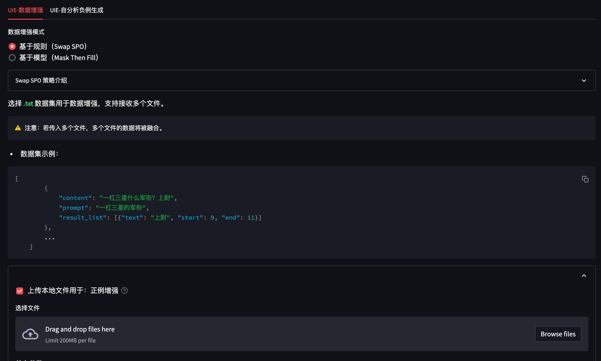
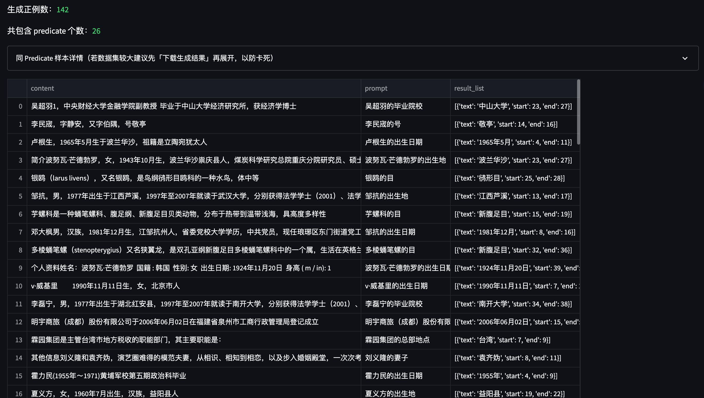
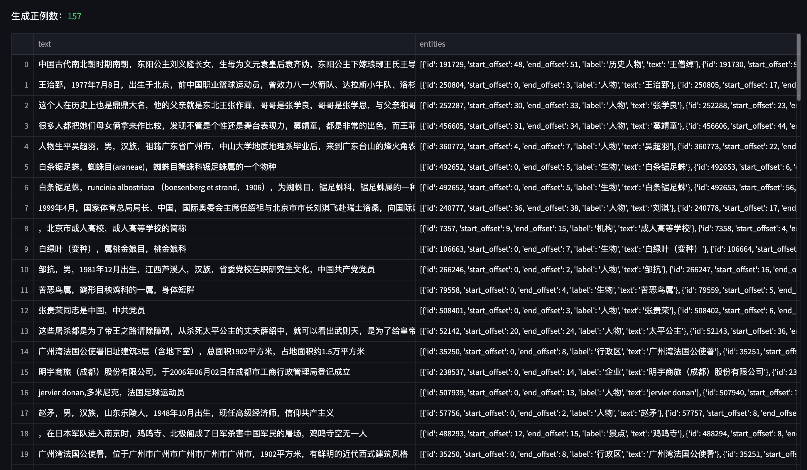
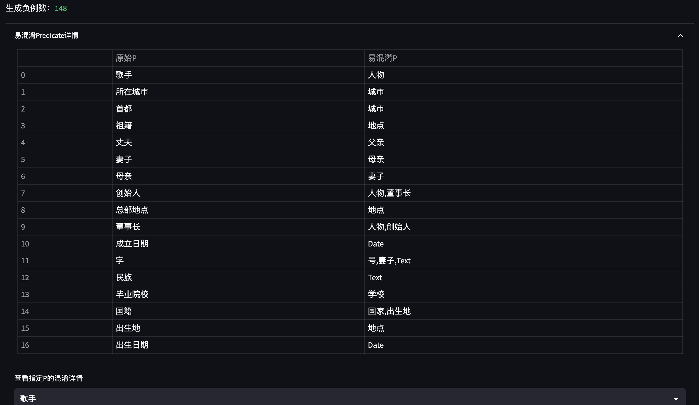
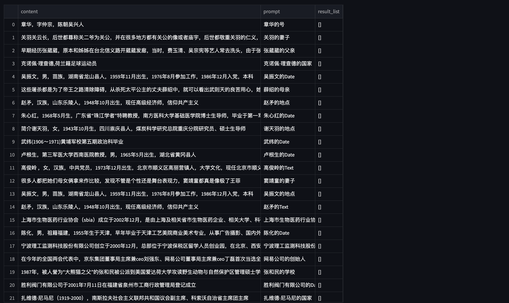

## UIE (Universal Information Extraction) for transformsers

UIE的官方文档在[这里](https://github.com/PaddlePaddle/PaddleNLP/tree/develop/model_zoo/uie)。

有关UIE的详细的详细介绍在[这里](https://zhuanlan.zhihu.com/p/589054073)。

该项目将借用transformers库来实现paddlenlp版本中UIE，已实现：

- [x] UIE 预训练模型自动下载

- [x] UIE Fine-Tuning 脚本 

- [x] 信息抽取、事件抽取数据增强（DA）策略（提升 recall）

- [x] 信息抽取、事件抽取自分析负例生成（Auto Neg）策略（提升 precision）

<br>

## 1. 环境安装

本项目基于 `pytorch` + `transformers` 实现，运行前请安装相关依赖包：

```sh
pip install -r ../requirements.txt
```

<br>

## 2. 数据集准备

项目中提供了一部分示例数据，数据来自DuIE数据集中随机抽取的100条，数据在 `data/DuIE` 。

若想使用`自定义数据`训练，只需要仿照示例数据构建数据集构建prompt和content即可：

```json
{"content": "谭孝曾是谭元寿的长子，也是谭派第六代传人", "result_list": [{"text": "谭元寿", "start": 4, "end": 7}], "prompt": "谭孝曾的父亲"}
{"content": "在圣保罗书院中学毕业后，曾钰成又在中学会考及大学入学考试中名列全港前十名", "result_list": [{"text": "曾钰成", "start": 12, "end": 15}], "prompt": "人物"}
{"content": "在圣保罗书院中学毕业后，曾钰成又在中学会考及大学入学考试中名列全港前十名", "result_list": [{"text": "圣保罗书院", "start": 1, "end": 6}], "prompt": "曾钰成的毕业院校"}
...
```

> Notes: 数据标注建议使用 doccano 完成，标注方法和标注转换可以参考 UIE 官方的详细介绍：[这里](https://github.com/PaddlePaddle/PaddleNLP/tree/develop/model_zoo/uie#%E6%95%B0%E6%8D%AE%E6%A0%87%E6%B3%A8)。

doccano导出数据如下所示：

```json
{"text": "谭孝曾是谭元寿的长子，也是谭派第六代传人", "entities": [{"id": 42517, "label": "人物", "start_offset": 0, "end_offset": 3, "text": "谭孝曾"}, {"id": 42518, "label": "人物", "start_offset": 4, "end_offset": 7, "text": "谭元寿"}], "relations": [{"id": 0, "from_id": 42517, "to_id": 42518, "type": "父亲"}]}
...
```

可以运行 `doccano.py` 来将标注数据（doccano）转换为训练数据（prompt）。


<br>

## 3. 模型训练

修改训练脚本 `train.sh` 里的对应参数, 开启模型训练：

```sh
python train.py \
    --pretrained_model "uie-base-zh" \
    --save_dir "checkpoints/DuIE" \
    --train_path "data/DuIE/train.txt" \
    --dev_path "data/DuIE/dev.txt" \
    --img_log_dir "logs/" \
    --img_log_name "UIE Base" \
    --batch_size 32 \
    --max_seq_len 256 \
    --learning_rate 5e-5 \
    --num_train_epochs 20 \
    --logging_steps 10 \
    --valid_steps 100 \
    --device cuda:0
```

正确开启训练后，终端会打印以下信息：

```python
...
  0%|          | 0/1 [00:00<?, ?ba/s]
100%|██████████| 1/1 [00:00<00:00,  6.91ba/s]
100%|██████████| 1/1 [00:00<00:00,  6.89ba/s]
global step 10, epoch: 1, loss: 0.00244, speed: 2.08 step/s
global step 20, epoch: 1, loss: 0.00228, speed: 2.17 step/s
global step 30, epoch: 1, loss: 0.00191, speed: 2.17 step/s
global step 40, epoch: 1, loss: 0.00168, speed: 2.14 step/s
global step 50, epoch: 1, loss: 0.00149, speed: 2.11 step/s
global step 60, epoch: 1, loss: 0.00138, speed: 2.15 step/s
global step 70, epoch: 2, loss: 0.00123, speed: 2.29 step/s
global step 80, epoch: 2, loss: 0.00112, speed: 2.12 step/s
global step 90, epoch: 2, loss: 0.00102, speed: 2.15 step/s
global step 100, epoch: 2, loss: 0.00096, speed: 2.15 step/s
Evaluation precision: 0.80851, recall: 0.84444, F1: 0.82609
best F1 performence has been updated: 0.00000 --> 0.82609
...
```

在 `logs/UIE Base.png` 文件中将会保存训练曲线图：

</img>

<br>

## 4. 模型预测

完成模型训练后，运行 `inference.py` 以加载训练好的模型并应用：

```python
 if __name__ == "__main__":
    from rich import print
    sentences = [
        '谭孝曾是谭元寿的长子，也是谭派第六代传人。'
    ]
    
    # NER 示例
    for sentence in sentences:
        ner_example(
            model,
            tokenizer,
            device,
            sentence=sentence, 
            schema=['人物']
        )

    # SPO 抽取示例
    for sentence in sentences:
        information_extract_example(
            model,
            tokenizer,
            device,
            sentence=sentence, 
            schema={
                    '人物': ['父亲'],
                }
        )
```

NER和事件抽取在schema的定义上存在一些区别：

* NER的schema结构为 `List` 类型，列表中包含所有要提取的 `实体类型`。

* 信息抽取的schema结构为 `Dict` 类型，其中 `Key` 的值是所有 `主语`，`Value` 对应该主语对应的所有 `属性`。

* 事件抽取的schema结构为 `Dict` 类型，其中 `Key` 的值是所有 `事件触发词`，`Value` 对应每一个触发词下的所有 `事件属性`。

```sh
python inference.py
```

得到以下推理结果：

```python
[+] NER Results: 
{
    '人物': ['谭孝曾', '谭元寿']
}

[+] Information-Extraction Results: 
{
    '谭孝曾': 
            {
                '父亲': ['谭元寿']
            }, 
    '谭元寿': {
                '父亲': []
            }
}
```

<br>

## 5. 数据增强（Data Augmentation）

信息抽取/事件抽取的数据标注成本较高，因此我们提供几种针对小样本下的数据增强策略。

包括：

* 正例：SwapSPO、Mask Then Fill

* 负例：自分析负例生成（Auto Neg）

所有实现均在 `Augmenter.py` 中，为了便于使用，我们将其封装为 web 服务以方便调用：

</img>

平台使用 `streamlit` 搭建，因此使用前需要先安装三方包：

```python
pip install streamlit==1.17.0
```

随后，运行以下命令开启标注平台：

```python
streamlit run web_da.py --server.port 8904
```
在浏览器中访问 ip + 端口（默认8904）即可打开标注平台。

<br>

### 5.1 正例：SwapSPO 策略介绍

Swap SPO 是一种基于规则的简单数据增强策略。

将同一数据集中相同 P 的句子分成一组，并随机交换这些句子中的 S 和 O。


* 策略输入：

**《夜曲》** 是 **周杰伦** **作曲** 的一首歌。

**《那些你很冒险的梦》** 是当下非常火热的一首歌，**作曲** 为 **林俊杰**。


* Swap SPO 后的输出：

**《夜曲》** 是当下非常火热的一首歌，**作曲** 为 **周杰伦**。

</img>

<br>

### 5.2 正例：Mask Then Fill 策略介绍

[Mask Then Fill](https://arxiv.org/pdf/2301.02427.pdf) 是一种基于生成模型的信息抽取数据增强策略。
                    
对于一段文本，我们其分为「关键信息段」和「非关键信息段」，包含关键词片段称为「关键信息段」。

下面例子中标粗的为 `关键信息片段`，其余的为 `非关键片段`。

> **大年三十** 我从 **北京** 的大兴机场 **飞回** 了 **成都**。


我们随机 [MASK] 住一部分「非关键片段」，使其变为： 

> **大年三十** 我从 **北京** [MASK] **飞回** 了 **成都**。

随后，将该句子喂给 filling 模型（T5-Fine Tuned）还原句子，得到新生成的句子：

> **大年三十** 我从 **北京** 首都机场作为起点，**飞回** 了 **成都**。

`Note:` filling 模型是一个生成模型，示例中我们使用中文 `T5` 微调得到 DuIE 数据集下的模型（暂未开源）。您可以参考 [这里](../data_augment/filling_model/readme.md) 微调一个更适合您自己数据集下的 filling 模型，并将训练好的模型路径填写至 `web_da.py` 中对应的位置。

```python
...
device = 'cpu'                                                 # 指定设备
generated_dataset_height = 800                                 # 生成样本展示高度                
max_show_num = 500                                             # 生成样本最大保存行数
max_seq_len = 128                                              # 数据集单句最大长度
batch_size = 128                                               # 负例生成时的batch_size

filling_model_path = '这里'                                     # fine-tuned filling model
...
```

</img>

<br>

### 5.3 负例：自分析负例生成（Auto Neg）策略介绍

信息抽取中通常会存在 `P混淆` 的问题，例如：

> 王文铭，76岁，是西红市多鱼村的大爷。

当我们同时生成 `年龄` 和 `去世年龄` 这种非常近义的 prompt 进行抽取时，可能会出现 `误召回` 的情况：

```python
prompt: 王文铭的年龄     answer: 76岁        -> 正确
prompt: 王文铭的去世年龄  answer: 76岁        -> 错误
```

因此，我们基于一个已训练好的模型，自动分析该模型在 `训练集` 下存在哪些易混淆的 P，并为这些 P 自动生成负例，以提升模型的 Precision 指标。

</img>
</img>

将新生成的负例加入 `原始训练数据集`，重新训练模型即可。

<br>

### 5.4 各种 DA 策略的实验效果

在 DuIE 100 条数据下测试，各种 DA 策略的效果如下所示（以下 P / R / F1 均取 F1 最高的 Epoch 指标）：

| DA Policy  | Precision（best）  | Recall（best）  | F1（best）  |
|---|---| ---| ---|
| baseline | 0.8085 | 0.8444 | 0.8260 |
| Swap SPO | 0.8409（↑） | 0.8222 | 0.8314（↑） |
| Auto Neg | 0.8297（↑） | 0.8666（↑） | 0.8478（↑） |
| **Mask Then Fill** | 0.9000（↑） | **1.0000（↑）** | 0.9473（↑） |
| **Mask Then Fill & Auto Neg** | **0.9777（↑）** | 0.9777（↑） | **0.9777（↑）** |
