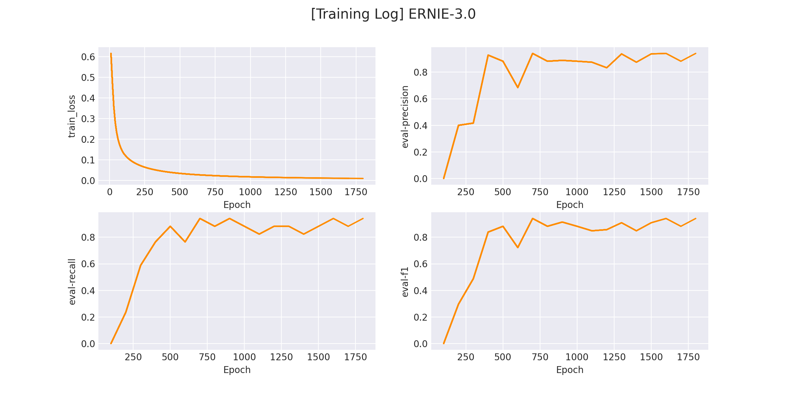

## UIE (Universal Information Extraction) for transformsers

UIE的官方文档在[这里](https://github.com/PaddlePaddle/PaddleNLP/tree/develop/model_zoo/uie)。

有关UIE的详细的详细介绍在[这里](https://zhuanlan.zhihu.com/p/589054073)。

该项目将借用transformers库来实现paddlenlp版本中UIE。

## 1. 环境安装

本项目基于 `pytorch` + `transformers` 实现，运行前请安装相关依赖包：

```sh
pip install -r ../requirements.txt
```

## 2. 数据集准备

项目中提供了一部分示例数据，我们使用一个简单的ner任务（关系抽取同理）来进行信息抽取任务，数据在 `data/simple_ner` 。

若想使用`自定义数据`训练，只需要仿照示例数据构建数据集构建prompt和content即可：

```json
{"content": "6月1日交通费68元", "result_list": [], "prompt": "出发地"}
{"content": "9月3日2点18分，加班打车回家，25元", "result_list": [{"text": "家", "start": 15, "end": 16}], "prompt": "目的地"}
{"content": "5月31号晚上10点54分打车回家49元", "result_list": [{"text": "5月31号晚上10点54分", "start": 0, "end": 13}], "prompt": "时间"}
...
```

> Notes: 数据标注建议使用 doccano 完成，标注方法和标注转换可以参考 UIE 官方的详细介绍：[这里](https://github.com/PaddlePaddle/PaddleNLP/tree/develop/model_zoo/uie#%E6%95%B0%E6%8D%AE%E6%A0%87%E6%B3%A8)。


## 3. 模型训练

修改训练脚本 `train.sh` 里的对应参数, 开启模型训练：

```sh
python train.py \
    --pretrained_model "uie-base-zh" \
    --save_dir "checkpoints/simple_ner" \
    --train_path "data/simple_ner/train.txt" \
    --dev_path "data/simple_ner/dev.txt" \
    --img_log_dir "logs/simple_ner" \
    --img_log_name "ERNIE-3.0" \
    --batch_size 8 \
    --max_seq_len 128 \
    --num_train_epochs 100 \
    --logging_steps 10 \
    --valid_steps 100 \
    --device cuda:0
```

正确开启训练后，终端会打印以下信息：

```python
...
global step 1880, epoch: 94, loss: 0.01507, speed: 10.06 step/s
global step 1890, epoch: 95, loss: 0.01499, speed: 10.09 step/s
global step 1900, epoch: 95, loss: 0.01492, speed: 10.05 step/s
Evaluation precision: 0.94444, recall: 1.00000, F1: 0.97143
best F1 performence has been updated: 0.94118 --> 0.97143
global step 1910, epoch: 96, loss: 0.01484, speed: 10.19 step/s
...
```

在 `logs/simple_ner` 文件下将会保存训练曲线图：

</img>

## 4. 模型预测

完成模型训练后，运行 `inference.py` 以加载训练好的模型并应用：

```python
 if __name__ == "__main__":
    from rich import print
    sentence = '5月17号晚上10点35分从公司加班打车回家，36块五。'
    
    # NER 示例
    ner_example(
        sentence=sentence, 
        schema=['出发地', '目的地', '时间']
    )

    # 事件抽取示例
    event_extract_example(
        sentence=sentence, 
        schema={
                '加班触发词': ['时间','地点'],
                '出行触发词': ['时间', '出发地', '目的地', '花费']
            }
    )
```

NER和事件抽取在schema的定义上存在一些区别：

* NER的schema结构为 `List` 类型，列表中包含所有要提取的 `实体类型`。

* 事件的schema结构为 `Dict` 类型，其中 `Key` 的值是所有 `事件触发词`，`Value` 对应每一个触发词下的所有 `事件属性`。

```sh
python inference.py
```

得到以下推理结果：

```python
[+] NER Results: 
{
    '出发地': ['公司'], 
    '目的地': ['家'], 
    '时间': ['5月17号晚上10点35分']
}

[+] Event-Extraction Results: 
{
    '加班触发词': {},
    '出行触发词': {
        '时间': ['5月17号晚上10点35分', '公司'],
        '出发地': ['公司'],
        '目的地': ['公司', '家'],
        '花费': ['36块五']
    }
}
```