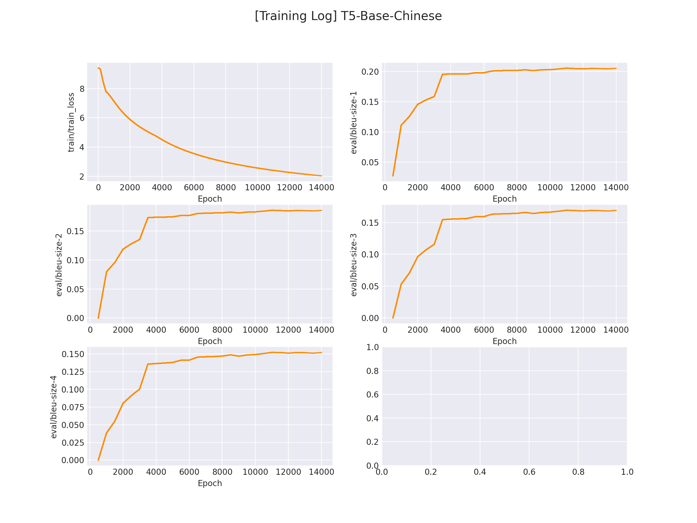

## 问答模型（Text-Generation, T5 Based）

问答模型是指通过输入一个「问题」和一段「文章」，输出「问题的答案」。

问答模型分为「抽取式」和「生成式」，抽取式问答可以使用 [UIE](https://github.com/HarderThenHarder/transformers_tasks/tree/main/UIE) 训练，这个实验中我们将使用「生成式」模型来训练一个问答模型。

我们选用「T5」作为 backbone，使用百度开源的「QA数据集」来训练得到一个生成式的问答模型。

## 1. 环境安装

本项目基于 `pytorch` + `transformers` 实现，运行前请安装相关依赖包：

```sh
pip install -r ../requirements.txt
```

## 2. 数据集准备

项目中提供了一部分示例数据，数据是百度开源的问答数据集，数据在 `data/DuReaderQG` 。

若想使用`自定义数据`训练，只需要仿照示例数据构建数据集即可：

```python
{"context": "违规分为:一般违规扣分、严重违规扣分、出售假冒商品违规扣分,淘宝网每年12月31日24:00点会对符合条件的扣分做清零处理,详情如下:|温馨提醒:由于出售假冒商品24≤N<48分,当年的24分不清零,所以会存在第一年和第二年的不同计分情况。", "answer": "12月31日24:00", "question": "淘宝扣分什么时候清零", "id": 203}
{"context": "生长速度 头发是毛发中生长最快的毛发，一般每天长0.27—0.4mm，每月平均生长约1.0cm，一年大概长10—14cm。但是，头发不可能无限制的生长，一般情况下，头发长至50—60cm，就会脱落再生新发。", "answer": "0.27—0.4mm", "question": "头发一天能长多少", "id": 328}
...
```

每一行为一个数据样本，`json` 格式。

其中，`"context"` 代表参考文章，`question` 代表问题，`"answer"` 代表问题答案。

## 3. 模型训练

修改训练脚本 `train.sh` 里的对应参数, 开启模型训练：

```sh
python train.py \
    --pretrained_model "uer/t5-base-chinese-cluecorpussmall" \
    --save_dir "checkpoints/DuReaderQG" \
    --train_path "data/DuReaderQG/train.json" \
    --dev_path "data/DuReaderQG/dev.json" \
    --img_log_dir "logs/DuReaderQG" \
    --img_log_name "T5-Base-Chinese" \
    --batch_size 32 \
    --learning_rate 1e-4 \
    --max_source_seq_len 256 \
    --max_target_seq_len 32 \
    --learning_rate 5e-5 \
    --num_train_epochs 50 \
    --logging_steps 10 \
    --valid_steps 500 \
    --device "cuda:0"
```

正确开启训练后，终端会打印以下信息：

```python
...
100%|█████████████████████████████████████████████████████████████████████████████████████████████████████████| 2/2 [00:00<00:00, 650.73it/s]
DatasetDict({
    train: Dataset({
        features: ['text'],
        num_rows: 14520
    })
    dev: Dataset({
        features: ['text'],
        num_rows: 984
    })

global step 10, epoch: 1, loss: 9.39613, speed: 1.60 step/s
global step 20, epoch: 1, loss: 9.39434, speed: 1.71 step/s
global step 30, epoch: 1, loss: 9.39222, speed: 1.72 step/s
global step 40, epoch: 1, loss: 9.38739, speed: 1.63 step/s
global step 50, epoch: 1, loss: 9.38296, speed: 1.63 step/s
global step 60, epoch: 1, loss: 9.37982, speed: 1.71 step/s
global step 70, epoch: 1, loss: 9.37385, speed: 1.71 step/s
global step 80, epoch: 1, loss: 9.36876, speed: 1.69 step/s
global step 90, epoch: 1, loss: 9.36209, speed: 1.72 step/s
global step 100, epoch: 1, loss: 9.35349, speed: 1.70 step/s
...
```

在 `logs/DuReaderQG` 文件下将会保存训练曲线图：

</img>

## 4. 模型推理

完成模型训练后，运行 `inference.py` 以加载训练好的模型并应用：

```python
...

if __name__ == '__main__':
    question = '治疗宫颈糜烂的最佳时间'
    context = '专家指出，宫颈糜烂治疗时间应选在月经干净后3-7日，因为治疗之后宫颈有一定的创面，如赶上月经期易发生感染。因此患者应在月经干净后3天尽快来医院治疗。同时应该注意，术前3天禁同房，有生殖道急性炎症者应治好后才可进行。'
    inference(qustion=question, context=context)
```

运行推理程序：

```sh
python inference.py
```

得到以下推理结果：

```sh
Q: "治疗宫颈糜烂的最佳时间"
C: "专家指出，宫颈糜烂治疗时间应选在月经干净后3-7日，因为治疗之后宫颈有一定的创面，如赶上月经期易发生感染。因此患者应在月经干净后3天尽快来医院治疗。同时应该注意，术前3天禁同房，有生殖道急性炎症者应治好后才可进行。"
A: "答案：月经干净后3-7日"
```

