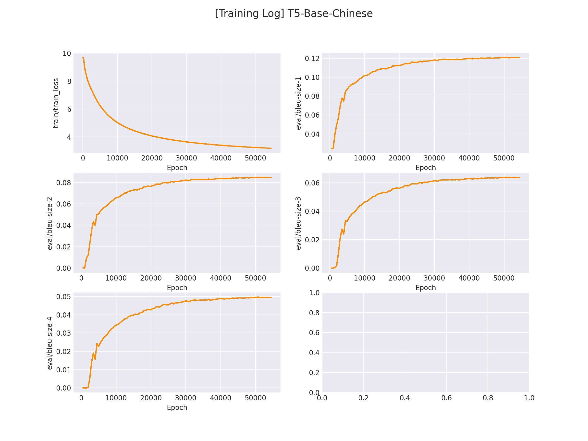

## Filling Model with T5

该项目用于将句子中 [MASK] 位置通过生成模型还原，以实现 UIE 信息抽取中 Mask Then Filling [数据增强策略](../../UIE/readme.md)。

[Mask Then Fill](https://arxiv.org/pdf/2301.02427.pdf) 是一种基于生成模型的信息抽取数据增强策略。对于一段文本，我们其分为「关键信息段」和「非关键信息段」，包含关键词片段称为「关键信息段」。下面例子中标粗的为 `关键信息片段`，其余的为 `非关键片段`。

> **大年三十** 我从 **北京** 的大兴机场 **飞回** 了 **成都**。


我们随机 [MASK] 住一部分「非关键片段」，使其变为： 

> **大年三十** 我从 **北京** [MASK] **飞回** 了 **成都**。

随后，将改句子喂给 filling 模型（T5-Fine Tuned）还原句子，得到新生成的句子：

> **大年三十** 我从 **北京** 首都机场作为起点，**飞回** 了 **成都**。

## 1. 环境安装

本项目基于 `pytorch` + `transformers` 实现，运行前请安装相关依赖包：

```sh
pip install -r ../requirements.txt
```

## 2. 数据集准备

项目中提供了一部分示例数据，数据来自DuIE数据集中的文本数据，数据在 `data/` 。

若想使用 `自定义数据` 训练，只需要仿照示例数据构建带 [MASK] 的文本即可，你也可以使用 `parse_data.py` 快速生成基于 `词粒度` 的训练数据：

```tsv
"Bortolaso Guillaume,法国籍[MASK]"中[MASK]位置的文本是：	运动员
"歌曲[MASK]是由歌手海生演唱的一首歌曲"中[MASK]位置的文本是：	《情一动心就痛》
...
```

每一行用 `\t` 分隔符分开，第一部分部分为 `带[MASK]的文本`，后一部分为 `[MASK]位置的原始文本（label）`。


## 3. 模型训练

修改训练脚本 `train.sh` 里的对应参数, 开启模型训练：

```sh
python train.py \
    --pretrained_model "uer/t5-base-chinese-cluecorpussmall" \
    --save_dir "checkpoints/t5" \
    --train_path "data/train.tsv" \
    --dev_path "data/dev.tsv" \
    --img_log_dir "logs" \
    --img_log_name "T5-Base-Chinese" \
    --batch_size 128 \
    --max_source_seq_len 128 \
    --max_target_seq_len 32 \
    --learning_rate 1e-4 \
    --num_train_epochs 20 \
    --logging_steps 50 \
    --valid_steps 500 \
    --device cuda:0
```

正确开启训练后，终端会打印以下信息：

```python
...
 0%|          | 0/2 [00:00<?, ?it/s]
100%|██████████| 2/2 [00:00<00:00, 21.28it/s]
DatasetDict({
    train: Dataset({
        features: ['text'],
        num_rows: 350134
    })
    dev: Dataset({
        features: ['text'],
        num_rows: 38904
    })
})
...
global step 2400, epoch: 1, loss: 7.44746, speed: 0.82 step/s
global step 2450, epoch: 1, loss: 7.42028, speed: 0.82 step/s
global step 2500, epoch: 1, loss: 7.39333, speed: 0.82 step/s
Evaluation bleu4: 0.00578
best BLEU-4 performence has been updated: 0.00026 --> 0.00578
global step 2550, epoch: 1, loss: 7.36620, speed: 0.81 step/s
...
```

在 `logs/T5-Base-Chinese.png` 文件中将会保存训练曲线图：

</img>

## 4. 模型预测

完成模型训练后，运行 `inference.py` 以加载训练好的模型并应用：

```python
 if __name__ == "__main__":
    masked_texts = [
        '"《μVision2单片机应用程序开发指南》是2005年2月[MASK]图书，作者是李宇"中[MASK]位置的文本是：'
    ]
    inference(masked_texts)
```

```sh
python inference.py
```

得到以下推理结果：

```python
maksed text: 
[
    '"《μVision2单片机应用程序开发指南》是2005年2月[MASK]图书，作者是李宇"中[MASK]位置的文本是：'
]
output: 
[
    '，中国工业出版社出版的'
]
```