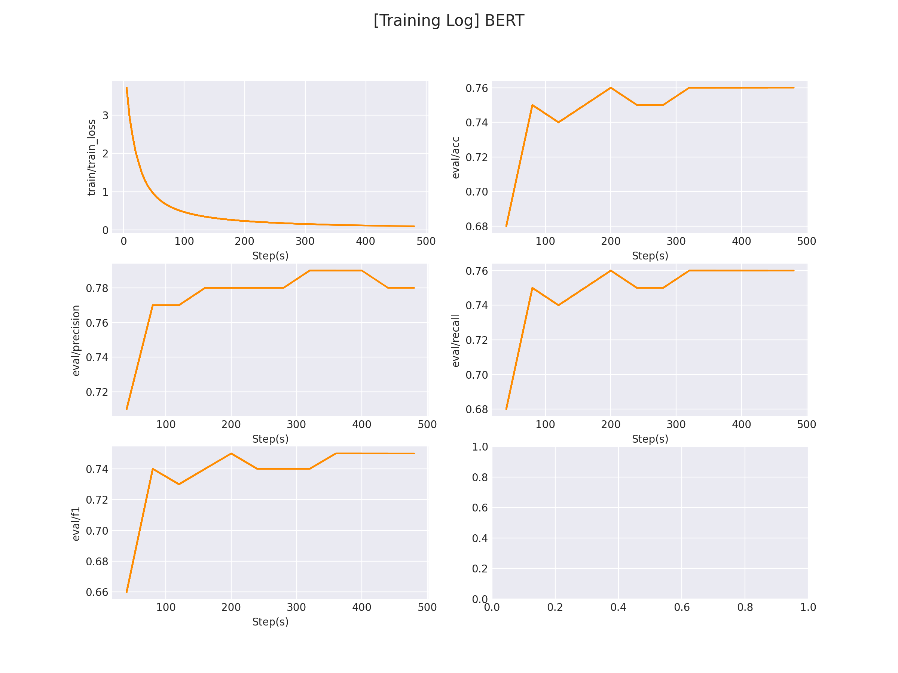

## PET (PatternExploiting Training)

PET (PatternExploiting Training) 是一种基于人工模板的 prompt 模型，有关 PET 的详细介绍在[这里]()。

### 1. 环境安装
本项目基于 `pytorch` + `transformers` 实现，运行前请安装相关依赖包：

```sh
pip install -r ../../requirements.txt
```

### 2. 数据集准备

#### 2.1 标签数据准备

项目中提供了一部分示例数据，根据用户评论预测用户评论的物品类别（分类任务），数据在 `data/comment_classify` 。

若想使用`自定义数据`训练，只需要仿照示例数据构建数据集即可：

```
水果	什么苹果啊，都没有苹果味，怪怪的味道，而且一点都不甜，超级难吃！
书籍	为什么不认真的检查一下， 发这么一本脏脏的书给顾客呢！
酒店	性价比高的酒店，距离地铁近，邻华师大，环境好。
...
```

每一行用 `\t` 分隔符分开，前半部分为`标签（label）`，后半部分为`原始输入`。

#### 2.2 Verbalizer准备

Verbalizer用于定义「真实标签」到「标签预测词」之间的映射。

在有些情况下，将「真实标签」作为 [MASK] 去预测可能不具备很好的语义通顺性，因此，我们会对「真实标签」做一定的映射。

例如：

```python
"日本爆冷2-1战胜德国"是一则[MASK][MASK]新闻。	体育
```

这句话中的标签为「体育」，但如果我们将标签设置为「足球」会更容易预测。

因此，我们可以对「体育」这个 label 构建许多个子标签，在推理时，只要预测到子标签最终推理出真实标签即可，如下：

```python
体育 -> 足球,篮球,网球,棒球,乒乓,体育
...
```
项目中提供了一部分示例数据在 `data/comment_classify/verbalizer.txt` 。

若想使用`自定义数据`训练，只需要仿照示例数据构建数据集即可：

```python
电脑	电脑
水果	水果
平板	平板
衣服	衣服
酒店	酒店
洗浴	洗浴
书籍	书籍
蒙牛	蒙牛
手机	手机
```

在例子中我们使用 1 对 1 的verbalizer，若想定义一对多的映射，只需要在后面用 `','` 分隔即可, e.g.:

```python
...
水果	苹果,香蕉,橘子
...
```

#### 2.3 Prompt设定

promot是人工构建的模板，项目中提供了一部分示例数据在 `data/comment_classify/prompt.txt` 。

```python
这是一条{MASK}评论：{textA}。
```

其中，用大括号括起来的部分为「自定义参数」，可以自定义设置大括号内的值。

示例中 {MASK} 代表 [MASK] token 的位置，{textA} 代表评论数据的位置。

你可以改为自己想要的模板，例如想新增一个 {textB} 参数：

```python
{textA}和{textB}是{MASK}同的意思。
```

此时，除了修改 prompt 文件外，还需要在 `utils.py` 文件中 `convert_example()` 函数中修改 `inputs_dict` 用于给对应的给每一个「自定义参数」赋值：

```python
...
content = content[:max_seq_len-10]      # 防止当[MASK]在尾部的时候被截掉

inputs_dict={                           # 传入对应prompt的自定义参数
    'textA': content,                   
    'MASK': '[MASK]',
    'textB' = ...                       # 给对应的自定义字段赋值
}
...
```

### 3. 模型训练
修改训练脚本 `train.sh` 里的对应参数, 开启模型训练：

```sh
python pet.py \
    --model "bert-base-chinese" \
    --train_path "data/comment_classify/train.txt" \
    --dev_path "data/comment_classify/dev.txt" \
    --save_dir "checkpoints/comment_classify/" \
    --img_log_dir "logs/comment_classify" \
    --img_log_name "BERT" \
    --verbalizer "data/comment_classify/verbalizer.txt" \       # verbalizer文件位置
    --prompt_file "data/comment_classify/prompt.txt" \          # prompt_file文件位置
    --batch_size 8 \
    --max_seq_len 256 \
    --valid_steps 40  \
    --logging_steps 5 \
    --num_train_epochs 200 \
    --max_label_len 2 \                                         # 子标签最大长度
    --rdrop_coef 5e-2 \
    --device "cuda:0"                                           # 指定使用GPU
```
正确开启训练后，终端会打印以下信息：

```python
...
DatasetDict({
    train: Dataset({
        features: ['text'],
        num_rows: 63
    })
    dev: Dataset({
        features: ['text'],
        num_rows: 590
    })
})
Prompt is -> 这是一条{MASK}评论：{textA}。
100%|████████████████████████████████████████████████████████████████████████████████████████| 1/1 [00:00<00:00, 12.96ba/s]
100%|████████████████████████████████████████████████████████████████████████████████████████| 1/1 [00:00<00:00,  2.55ba/s]
global step 5, epoch: 0, loss: 3.74432, speed: 2.67 step/s
global step 10, epoch: 1, loss: 3.06417, speed: 5.86 step/s
global step 15, epoch: 1, loss: 2.51641, speed: 5.73 step/s
global step 20, epoch: 2, loss: 2.12264, speed: 5.84 step/s
global step 25, epoch: 3, loss: 1.80121, speed: 5.82 step/s
global step 30, epoch: 3, loss: 1.52964, speed: 5.78 step/s
...
```

在 `logs/sentiment_classification` 文件下将会保存训练曲线图：

</img>


### 4. 模型预测

完成模型训练后，运行 `inference.py` 以加载训练好的模型并应用：

```python
...
contents = [
        '地理环境不错，但对面一直在盖楼，门前街道上打车不方便。',
        '跟好朋友一起凑单买的，很划算，洗发露是樱花香的，挺好的。。。'
    ]                           # 自定义评论
res = inference(contents)       # 推测评论类型
...
```

运行推理程序：

```sh
python inference.py
```

得到以下推理结果：

```python
Prompt is -> 这是一条{MASK}评论：{textA}。
Used 0.47s.
inference label(s): ['酒店', '洗浴']
```