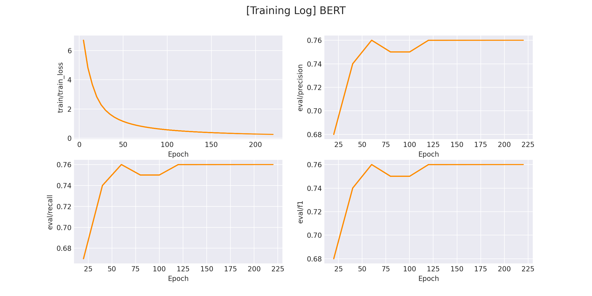

### P-tuning：Auto Learning prompt pattern
---

P-tuning 是 prompt learning 下的一个重要分支，关于 P-tuning 的详细介绍在：[这里](https://zhuanlan.zhihu.com/p/583022692)。


### 1. 环境安装
本项目基于 `pytorch` + `transformers` 实现，运行前请安装相关依赖包：

```sh
pip install -r ../../requirements.txt
```

### 2. 数据集准备

#### 2.1 标签数据准备

项目中提供了一部分示例数据，根据用户评论预测用户评论的物品类别（分类任务），数据在 `data/comment_classify` 。

若想使用`自定义数据`训练，只需要仿照示例数据构建数据集即可：

```
水果	什么苹果啊，都没有苹果味，怪怪的味道，而且一点都不甜，超级难吃！
书籍	为什么不认真的检查一下， 发这么一本脏脏的书给顾客呢！
酒店	性价比高的酒店，距离地铁近，邻华师大，环境好。
...
```

每一行用 `\t` 分隔符分开，前半部分为`标签（label）`，后半部分为`原始输入`。

#### 2.2 Verbalizer准备

Verbalizer用于定义「真实标签」到「标签预测词」之间的映射。

在有些情况下，将「真实标签」作为 [MASK] 去预测可能不具备很好的语义通顺性，因此，我们会对「真实标签」做一定的映射。

例如：

```python
"日本爆冷2-1战胜德国"是一则[MASK][MASK]新闻。	体育
```

这句话中的标签为「体育」，但如果我们将标签设置为「足球」会更容易预测。

因此，我们可以对「体育」这个 label 构建许多个子标签，在推理时，只要预测到子标签最终推理出真实标签即可，如下：

```python
体育 -> 足球,篮球,网球,棒球,乒乓,体育
...
```
项目中提供了一部分示例数据在 `data/comment_classify/verbalizer.txt` 。

若想使用`自定义数据`训练，只需要仿照示例数据构建数据集即可：

```python
电脑	电脑
水果	水果
平板	平板
衣服	衣服
酒店	酒店
洗浴	洗浴
书籍	书籍
蒙牛	蒙牛
手机	手机
```

在例子中我们使用 1 对 1 的verbalizer，若想定义一对多的映射，只需要在后面用 `','` 分隔即可, e.g.:

```python
...
水果	苹果,香蕉,橘子
...
```

### 3. 模型训练
修改训练脚本 `train.sh` 里的对应参数, 开启模型训练：

```sh
python p_tuning.py \
    --model "bert-base-chinese" \               # backbone
    --train_path "data/comment_classify/train.txt" \
    --dev_path "data/comment_classify/dev.txt" \
    --verbalizer "data/comment_classify/verbalizer.txt" \ # verbalizer存放地址
    --save_dir "checkpoints/comment_classify/" \
    --img_log_dir "logs/comment_classify" \     # loss曲线图存放地址
    --img_log_name "BERT" \                     # loss曲线图文件名
    --batch_size 16 \
    --max_seq_len 128 \
    --valid_steps 20  \
    --logging_steps 5 \
    --num_train_epochs 50 \
    --max_label_len 2 \                         # 标签最大长度
    --p_embedding_num 15 \                      # p_token长度
    --device "cuda:0"                           # 指定使用哪块gpu
```
正确开启训练后，终端会打印以下信息：

```python
...
global step 5, epoch: 1, loss: 6.50529, speed: 4.25 step/s
global step 10, epoch: 2, loss: 4.77712, speed: 6.36 step/s
global step 15, epoch: 3, loss: 3.55371, speed: 6.19 step/s
global step 20, epoch: 4, loss: 2.71686, speed: 6.38 step/s
Evaluation precision: 0.70000, recall: 0.69000, F1: 0.69000
best F1 performence has been updated: 0.00000 --> 0.69000
global step 25, epoch: 6, loss: 2.20488, speed: 6.21 step/s
global step 30, epoch: 7, loss: 1.84836, speed: 6.22 step/s
global step 35, epoch: 8, loss: 1.58520, speed: 6.22 step/s
global step 40, epoch: 9, loss: 1.38746, speed: 6.27 step/s
Evaluation precision: 0.75000, recall: 0.75000, F1: 0.75000
best F1 performence has been updated: 0.69000 --> 0.75000
global step 45, epoch: 11, loss: 1.23437, speed: 6.14 step/s
global step 50, epoch: 12, loss: 1.11103, speed: 6.16 step/s
...
```

在 `logs/sentiment_classification` 文件下将会保存训练曲线图：

</img>


### 4. 模型预测

完成模型训练后，运行 `inference.py` 以加载训练好的模型并应用：

```python
...
contents = [
    "苹果卖相很好，而且很甜，很喜欢这个苹果，下次还会支持的", 
    "这破笔记本速度太慢了，卡的不要不要的"
]   # 自定义评论
res = inference(contents)       # 推测评论类型
...
```

运行推理程序：

```sh
python inference.py
```

得到以下推理结果：

```sh
inference label(s): ['水果', '电脑']
```
