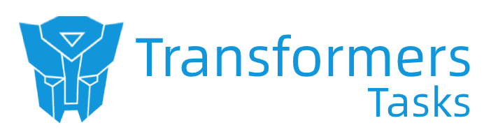

 

  

   

---

该项目集成了基于 [transformers](https://huggingface.co/docs/transformers/index) 库实现的多种 NLP 任务。

[huggingface transformers](https://huggingface.co/docs/transformers/index) 是一个非常棒的开源框架，支持非常方便的加载/训练 transformer 模型，你可以在[这里](https://huggingface.co/docs/transformers/quicktour)看到该库的安装方法和入门级调用，该库也能支持用户非常便捷的[微调一个属于自己的模型](https://huggingface.co/docs/transformers/training)。

在该项目中我们集成了一些主流的NLP任务，你可以找到对应的任务，将代码中的`训练数据集`更换成`你自己任务下的数据集`从而训练一个符合你自己任务下的模型。

 

目前已经实现的NLP任务如下（更新中）：

#### 1. 文本匹配（Text Matching）

> 计算文本间的相似度，多用于：`搜索召回`、`文本检索`、`蕴含识别` 等任务。

| 模型  | 传送门  |
|---|---|
| 【监督】概览  | [[这里]](./text_matching/supervised/readme.md) |
| 【监督】PointWise（单塔）  | [[这里]](./text_matching/supervised/train_pointwise.sh) |
| 【监督】DSSM（双塔）  | [[这里]](./text_matching/supervised/train_dssm.sh) |
| 【监督】Sentence Bert（双塔）  | [[这里]](./text_matching/supervised/train_sentence_transformer.sh) |
| 【无监督】SimCSE  | [[这里]](./text_matching/unsupervised/simcse/readme.md) |

 

#### 2. 信息抽取（Information Extraction）

> 在给定的文本段落中抽取目标信息，多用于：`命名实体识别（NER）`，`实体关系抽取（RE）` 等任务。

| 模型  | 传送门  |
|---|---|
| 通用信息抽取（Universe Information Extraction, UIE）  | [[这里]](./UIE/readme.md) |

 

#### 3. Prompt任务（Prompt Tasks）

> 通过设计提示（prompt）模板，实现使用更少量的数据在预训练模型（Pretrained Model）上得到更好的效果，多用于：`Few-Shot`，`Zero-Shot` 等任务。

| 模型  | 传送门  |
|---|---|
| PET（基于人工定义 prompt pattern 的方法）  | [[这里]](./prompt_tasks/PET/readme.md) |
| p-tuning（机器自动学习 prompt pattern 的方法）  | [[这里]](./prompt_tasks/p-tuning/readme.md) |

 

#### 4. 文本分类（Text Classification）

> 对给定文本进行分类，多用于：`情感识别`，`文章分类识别` 等任务。

| 模型  | 传送门  |
|---|---|
| BERT-CLS（基于 BERT 的分类器）  | [[这里]](./text_classification/train.sh) |

 

#### 5. 强化学习 & 语言模型（Reinforcement Learning & Language Model）

> RLHF（Reinforcement Learning from Human Feedback）通过人类的反馈，将强化学习（RL）用于更新语言生成模型（LM），从而达到更好的生成效果（代表例子：ChatGPT）；通常包括：`奖励模型（Reward Model）` 训练和 `强化学习（Reinforcement Learning）` 训练两个阶段。

| 模型  | 传送门  |
|---|---|
| RLHF（Reward Model 训练，PPO 更新 GPT2）  | [[这里]](./RLHF/readme.md) |

 

#### 6. 文本生成（Text Generation）

> 文本生成（NLG），通常用于：`小说续写`，`智能问答`，`对话机器人` 等任务。

| 模型  | 传送门  |
|---|---|
| 中文问答模型（T5-Based） | [[这里]](./answer_generation/readme.md) |
| Filling 模型（T5-Based） | [[这里]](./data_augment/filling_model/readme.md) |

 

#### 7. 大模型应用（LLM Application）

> 构建大模型（LLM）zero-shot 解决多种任务所需的 prompt pattern(s)。

| 模型  | 传送门  |
|---|---|
| 文本分类（chatglm-6b-Based） | [[这里]](./LLM/zero-shot/readme.md) |
| 文本匹配（chatglm-6b-Based） | [[这里]](./LLM/zero-shot/readme.md) |
| 信息抽取（chatglm-6b-Based） | [[这里]](./LLM/zero-shot/readme.md) |
| 大模型性格测试（LLMs MBTI） | [[这里]](./LLM/llms_mbti/readme.md) |

 

#### 8. 大模型训练（LLM Training）

> 大模型训练相关，涵盖预训练，指令微调，奖励模型，强化学习。

| 模型  | 传送门  |
|---|---|
| ChatGLM-6B Finetune | [[这里]](./LLM/chatglm_finetune/readme.md) |
| 从零开始训练大模型 | [[这里]](./LLM/LLMsTrainer/readme.md) |

 

#### 9. 工具类（Tools）

> 一些常用工具集合。

| 工具名  | 传送门  |
|---|---|
| Tokenizer Viewer | [[这里]](./tools/tokenizer_viewer/readme.md) |