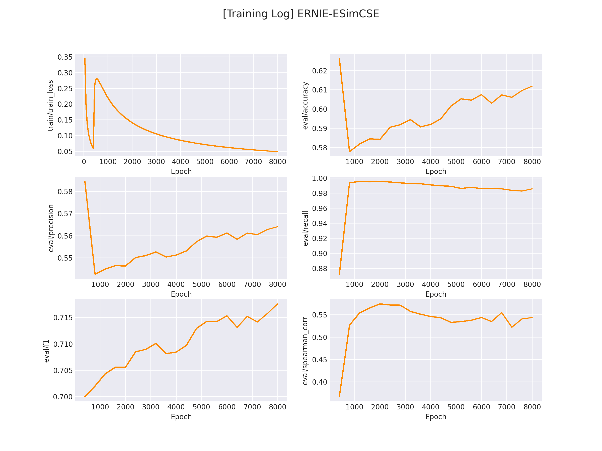

# SimCSE: Simple Contrastive Learning of Sentence Embeddings

文本匹配多用于计算两个文本之间的相似度，该示例会基于 ESimCSE 实现一个无监督的文本匹配模型的训练流程。

有关 SimCSE/ESimCSE 的详细介绍在[这里](https://zhuanlan.zhihu.com/p/599230890)。

## 1. 环境安装

本项目基于 `pytorch` + `transformers` 实现，运行前请安装相关依赖包：

```sh
pip install -r ../requirements.txt
```

## 2. 数据集准备

项目中提供了一部分示例数据，我们使用未标注的用户搜索记录数据来训练一个文本匹配模型，数据在 `data/LCQMC` 。

若想使用`自定义数据`训练，只需要仿照示例数据构建数据集即可：

* 训练集：

```python
喜欢打篮球的男生喜欢什么样的女生
我手机丢了，我想换个手机
大家觉得她好看吗
求秋色之空漫画全集
晚上睡觉带着耳机听音乐有什么害处吗？
学日语软件手机上的
...
```

* 测试集：

```python
开初婚未育证明怎么弄？	初婚未育情况证明怎么开？	1
谁知道她是网络美女吗？	爱情这杯酒谁喝都会醉是什么歌	0
人和畜生的区别是什么？	人与畜生的区别是什么！	1
男孩喝女孩的尿的故事	怎样才知道是生男孩还是女孩	0
...
```
由于是无监督训练，因此训练集（train.txt）中不需要记录标签，只需要大量的文本即可。

测试集（dev.tsv）用于测试无监督模型的效果，因此需要包含真实标签。

每一行用 `\t` 分隔符分开，第一部分部分为`句子A`，中间部分为`句子B`，最后一部分为`两个句子是否相似（label）`。


## 3. 模型训练

修改训练脚本 `train.sh` 里的对应参数, 开启模型训练：

```sh
python train.py \
    --model "nghuyong/ernie-3.0-base-zh" \
    --train_path "data/LCQMC/train.txt" \
    --dev_path "data/LCQMC/dev.tsv" \
    --save_dir "checkpoints/LCQMC" \
    --img_log_dir "logs/LCQMC" \
    --img_log_name "ERNIE-ESimCSE" \
    --learning_rate 1e-5 \
    --dropout 0.3 \
    --batch_size 64 \
    --max_seq_len 64 \
    --valid_steps 400 \
    --logging_steps 50 \
    --num_train_epochs 8 \
    --device "cuda:0"
```

正确开启训练后，终端会打印以下信息：

```sh
...
0%|          | 0/2 [00:00<?, ?it/s]
100%|██████████| 2/2 [00:00<00:00, 226.41it/s]
DatasetDict({
    train: Dataset({
        features: ['text'],
        num_rows: 477532
    })
    dev: Dataset({
        features: ['text'],
        num_rows: 8802
    })
})
global step 50, epoch: 1, loss: 0.34367, speed: 2.01 step/s
global step 100, epoch: 1, loss: 0.19121, speed: 2.02 step/s
global step 150, epoch: 1, loss: 0.13498, speed: 2.00 step/s
global step 200, epoch: 1, loss: 0.10696, speed: 1.99 step/s
global step 250, epoch: 1, loss: 0.08858, speed: 2.02 step/s
global step 300, epoch: 1, loss: 0.07613, speed: 2.02 step/s
global step 350, epoch: 1, loss: 0.06673, speed: 2.01 step/s
global step 400, epoch: 1, loss: 0.05954, speed: 1.99 step/s
Evaluation precision: 0.58459, recall: 0.87210, F1: 0.69997, spearman_corr: 
0.36698
best F1 performence has been updated: 0.00000 --> 0.69997
global step 450, epoch: 1, loss: 0.25825, speed: 2.01 step/s
global step 500, epoch: 1, loss: 0.27889, speed: 1.99 step/s
global step 550, epoch: 1, loss: 0.28029, speed: 1.98 step/s
global step 600, epoch: 1, loss: 0.27571, speed: 1.98 step/s
global step 650, epoch: 1, loss: 0.26931, speed: 2.00 step/s
...
```

在 `logs/LCQMC` 文件下将会保存训练曲线图：

</img>

## 4. 模型推理

完成模型训练后，运行 `inference.py` 以加载训练好的模型并应用：

```python
...
    if __name__ == '__main__':
    ...
    sentence_pair = [
        ('男孩喝女孩的故事', '怎样才知道是生男孩还是女孩'),
        ('这种图片是用什么软件制作的？', '这种图片制作是用什么软件呢？')
    ]
    ...
    res = inference(query_list, doc_list, model, tokenizer, device)
    print(res)
```

运行推理程序：

```sh
python inference.py
```

得到以下推理结果：

```python
[0.1527191698551178, 0.9263839721679688]   # 第一对文本相似分数较低，第二对文本相似分数较高
```
