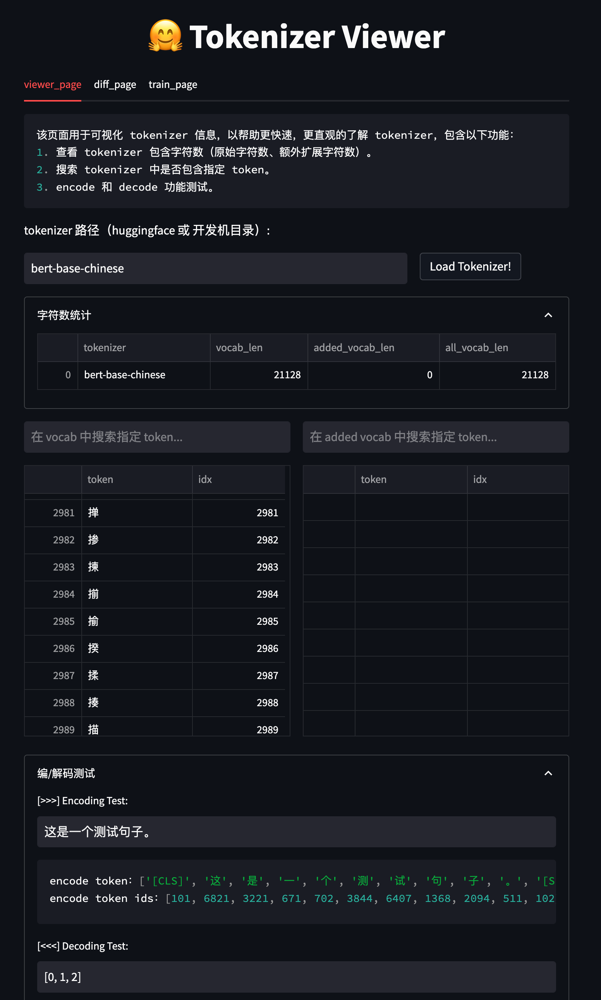

# Tokenizer Viewer

Tokenizer Viwer 是一款方便快速预览 tokenizer 的工具。

其功能包括：

- [x] 查看词表内容，字符数统计。
- [x] 搜索 tokenizer 中是否包含指定 token。
- [x] 编码（encode）/ 解码（decode）测试。
- [x] 比较 2 个 tokenizer 之间的 token 差异。
- [ ] 将 2 个不同的 tokenizer 做 merge。

使用 `strat.sh` 启动平台，可在 `--server.port` 调整启用端口。

```sh
streamlit run web_ui.py --server.port 8001
```

<div align='center'>



</div>